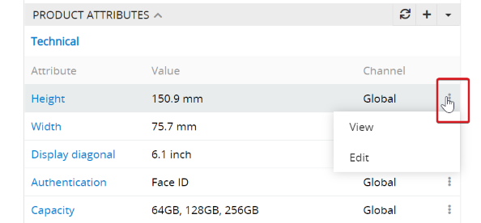

# Wie kann man eine vollständige und qualitative Produktbeschreibung in 6 Schritten erstellen? 

Moderne CMS (Content Management Systeme) ermöglichen, ein Produkt in ein paar Klicks zu erstellen. Der Besucher der Website kann jedoch die Entscheidung über den Kauf Ihres Produkts nicht treffen, wenn die von Ihnen bereitgestellten Produktinformationen keine Antworten auf die Kundenfragen beinhalten (oder der Kunde kann die Antworten nicht schnell finden). Welche Vorteile hat dieses Produkt? Wodurch unterscheidet sich das Produkt von den Produkten anderer Hersteller? Durch den Stoff? Durch die Farbe? Für jede Produktgruppe kann man eigene kritische Fragen feststellen, auf welche der Kunde Antworten benötigt. 

Wenn Sie sich von Mitbewerbern unterscheiden möchten, müssen Sie mit ihren Produktinformationen beginnen und diese möglichst detailliert und qualitativ gestalten. Der Endverbraucher darf keine Fragen oder Zweifel haben, wenn er die Entscheidung über den Kauf Ihres Produktes trifft.

Damit die Produktinformationen qualitativ und vollständig sind, muss man:

-   detaillierte Marketing Produktbeschreibungen schreiben – man muss das Produkt auf solche Weise beschreiben, dass der Kunde es sich auch mit geschlossenen Augen vorstellen kann, nachdem man ihm die Beschreibung vorliest.
-   das Produkt möglichst genau mithilfe von technischen Charakteristiken beschreiben. Sie müssen in Betracht ziehen, dass je mehr Attribute das Produkt besitzt, der Endkunde umso mehr Filtermöglichkeiten hat.

-   Qualitative Produktfotos in allen Winkeln hochladen. Bei Bedarf können Sie auch Fotos einzelner Produktteile präsentieren, wenn es dem Kunden bei der Kaufentscheidung hilft.
-   Zusätzliche Medieninformationen hinzufügen, z.B. Produktvideos, Anleitungen usw.
-   Produktassoziationen anbieten, um den Endkunden auch auf andere Produkte aufmerksam zu machen.

In diesem Artikel werden wir die Schritte zur Erstellung einer qualitativen Produktbeschreibung in AtroPIM ausführlich darstellen.

## Schritt 1: Erstellen Sie eine richtige Produktfamilie

Für ein neu erstelltes Produkt kann man die Produktfamilie angeben, damit die benötigten auszufüllenden Produktattribute mit dem Produkt verlinkt werden. Vor der Erstellung der neuen Produkte muss man sich davon überzeugen, dass alle notwendigen Produktfamilien erstellt und richtig konfiguriert sind – somit vermeiden Sie eine wiederholte Erstellung.

Für nähere Informationen zur Erstellung und Konfiguration der Produktfamilien lesen Sie den Artikel \[Wie kann man die Produktfamilien erstellen? \] (https://wwwwwwwwwwwwwwww). 

## Schritt 2: Erstellen Sie ein neues Produkt

In AtroPIM kann man die Produkteigenschaften auf zwei Weisen abspeichern:

-   Über Produktfelder (Felder der Entität Produkte) – können auch als Metadata verwendet werden.
-   Über Produktattribute – zusätzliche Entität, die mit den Produkten über eine many-to-one Beziehung verknüpft ist.

Der Nutzer kann eine beliebige Anzahl von Produktattributen erstellen. Produktfelder kann nur der Administator über den `Entity Manager` erstellen. Der Hauptunterschied besteht darin, dass alle Produkte identische Produktfelder haben, aber unterschiedliche Produktattribute.

Um ein Produkt zu erstellen, muss man auf die Entität Produkt übergehen und auf `Create Product` klicken (oben rechts). Es wird ein Pop-up Fenster angezeigt, in dem man die Pflichtfelder des neuen Produktes ausfüllen soll.

Die Produktfelder können die Informationen beinhalten, die für System-Nutzer, aber nicht für Endkunden von Bedeutung sind. Das können ID, SKU, alternative Namen der Produkte usw. sein.

## Schritt 3: Geben Sie die Attributwerte des Produktes an

Das Attribut (die Eigenschaft) – ist eine Charakteristik des Produktes. Das sind z.B. “Stil” für Uhren, “Diagonale” für Bildschirme und “Druckleistung” für Drucker. Die Attribute können funktioneller, emotionaler oder ästhetischer Natur sein und bestimmte Eigenschaften des Produktes bezeichnen, z.B. Gewicht, Höhe, Länge, Breite, Farbe usw.

Produktattribute können mit den Produkten auf zwei Weisen verknüpft werden – über Produktfamilien:

oder direkt.

Wenn man ein Produkt z.B. der Produktfamilie “Hemden” zuordnet,  werden diese Attribute mit dem Produkt automatisch verknüpft und werden von den Nutzern folgende Attribute abgefragt: Geschlecht, Größe, Farbe, Kragenweite usw. (abhängig davon, welche Attribute der Produktfamilie “Hemden” zugeordnet sind). Deshalb hat die richtige Konfiguration von Produktfamilien sehr wichtige Bedeutung für die Endqualität der Produktinformationen. Für nähere Informationen dazu lesen Sie den Artikel \[“Wie kann man die Produktfamilien erstellen?”\] (https://wwwwwwwwwww).

Produktattribute können mit den Produkten auch direkt verlinkt werden, diese sind dann Pflichtfelder für ein Produkt. Diese Attribute hat das Produkt zusätzlich zu denen, die von der Produktfamilie vererbt wurden. Falls keine Produktfamilie zu einem Produkt zugeordnet ist, wird dieses nur über solche Attribute verfügen, die ihm direkt zugeordnet worden sind.

Nachdem die Produktattribute mit dem Produkt verknüpft sind, kann man die Attributwerte eintragen. Dies ist auf zwei Weisen möglich, über das Kontextmenü eines Attributs:

oder über Editieren des Produktes:

Für nähere Informationen über Attribute lesen Sie bitte die Dokumentation \[“Attribute”\] (https://wwwwwwwwwwww).

## Schritt 4: Fügen Sie Bilder und andere Assets hinzu

Die potenziellen Kunden nehmen die Produkte in erster Linie visuell wahr. Deswegen sind qualitative Produktfotos bei der Kaufentscheidung ausschlaggebend. Je mehr solcher Produktbilder zur Verfügung stehen, desto besser kann man das Produkt untersuchen, also seine Qualität und Besonderheiten einschätzen und bewerten, ob es den Kundenanforderungen entspricht.

Im AtroPIM kann ein Bild zu mehr als einem Produkt zugeordnet werden. Und wenn man dieses Bild durch ein neues ersetzen muss, braucht man es nur an einem Ort zu machen, und dank den Verknüpfungen wird das Bild bei allen Produkten gleichzeitig ersetzt.

Die Produktbilder werden im Panel `Asset Relations` angezeigt. Die Assets werden automatisch nach deren Typen gruppiert.

Hier kann man neue Assets hochladen (1) oder die im DAM bereits bestehende Assets aussuchen (2). Man kann die Dateien verschiedener Formate und Größen hochladen: csv, png, md, jpg, zip und andere Dateien, die von der Konfiguration erlaubt sind. Maximale Dateigröße kann auch konfiguriert werden. Zur Bequemlichkeit wurde die Möglichkeit hinzugefügt, das Asset nach dem Code auszuwählen, der für jedes Asset einzigartig ist.

Es ist auch möglich, verschiedene Rollen den Assets zu vergeben. Die möglichen Werte sind über den `Entity Manager` konfigurierbar. Dem Hauptbild sollte die Rolle Main zugeordnet sein. Es wird im Panel `Product Preview` angezeigt:

Der Nutzer hat die Möglichkeit, die Reihenfolge der Bilder mittels Drag-and-Drop zu bestimmen.

### Metadaten für Bilder

Der Nutzer hat zudem die Möglichkeit, für jedes Asset seine Metadaten einzufügen. Diese sind über die `Administration` für die Entität Asset Relation über den `Entity Manager` konfigurierbar.

### Scope für Bilder

Man kann für jedes Asset den Scope angeben: `Global` oder `Channel`. Wenn Sie `Global` auswählen, wird das Asset allen Kanälen zugeordnet, für die Ihr Produkt verfügbar ist. Wenn Sie das Asset nur in bestimmte Kanäle exportieren wollen, muss man `Channel` als Scope und einen entsprechenden Kanal auswählen.

Diese Funktion kann im Fall behilflich sein, wenn Sie bestimmten Handelspartnern (unter allen) bestimmte Wettbewerbsvorteile bescheren wollen, z.B. den Zugang zu einer größeren Anzahl von Bildern oder zu Bildern mit höherer Qualität. Dank dieser Funktion können Sie bei Bedarf zu jedem Kanal neue Bilder hinzufügen. Wenn Sie beispielsweise zwei Kanäle haben, die aber in verschiedenen Regionen verwendet werden (z.B. Korea und Indien), können Sie zu den Produkten die Bilder mit Models entsprechender Herkunft für jedes Land separat hinzufügen.

## Schritt 5: Geben Sie assoziierte Produkte an

Die Produktassoziationen können ein wichtiges Marketingmittel für die Erhöhung Ihres Umsatzes sein, da hierbei neben dem Hauptprodukt noch zusätzliche Produkte angeboten werden. Die Assoziation ist eine bestimmte Art von Beziehung zwischen den Produkten; die benötigten Beziehungen kann jeder Nutzer für sich selbst festlegen, z.B. Cross- und Up-Selling.

Man kann bestehende vorkonfigurierte Assoziationen nutzen oder neue Assoziationen erstellen. Die Assoziationen können die Effektivität und Konversionsrate verbessern. Für nähere Informationen lesen Sie \[“Wie kann man das System richtig konfigurieren? – Assoziationen konfigurieren”\] (https://wwwwwwwwww).

Im AtroPIM kann man sowohl einseitige (das Produkt A ist mit dem Produkt B assoziiert, aber nicht umgekehrt) als auch zweiseitige Assoziationen erstellen (das Produkt A und das Produkt B sind miteinander assoziiert). Bei der zweiseitigen Assoziation gibt es auch die Möglichkeit, verschiedene Assoziationstypen zwischen den Produkten anzugeben.

Um eine Produktassoziation zu erstellen, muss man auf die entsprechende Produktseite übergehen und im Panel `Associated Product` auf `✚` klicken. Es wird ein Popup geöffnet, wo man die Assoziation mit diesem und einem ausgewählten Produkt erstellen kann. Wenn Sie die Checkbox `Both Directions` setzen, wird das zusätzliche Feld `Related Association` angezeigt. In diesem Feld können Sie den Typ für Rückassoziation auswählen. So erstellen Sie eine zweiseitige Assoziation: das Produkt A wird mit dem Produkt B assoziiert, der Assoziationstyp ist dabei Up-Sell; und das Produkt B wird mit dem Produkt A assoziiert, der Assoziationstyp ist dabei Down-Sell.

Alle Assoziationen zwischen den Produkten kann man auf der Seite `Associated Products` ansehen. Bei der Erstellung einer zweiseitigen Assoziation werden auf diese Seite zwei verschiedene Einträge hinzugefügt.

## Schritt 6: Kategorisieren Sie das Produkt

Damit Ihre Produktbeschreibungen die Endkunden erreichen, muss man für jedes Produkt eine oder mehrere Kategorien angeben, denen das Produkt zugeordnet wird.

Im AtroPIM ist es möglich, einen oder mehrere Kategoriebäume zu nutzen, die mithilfe von Parent-Child Beziehungen automatisch erstellt werden. Jede Child-Kategorie kann nur eine Parent-Kategorie haben, jede Parent-Kategorie kann eine oder mehrere Child-Kategorien haben.

Über die Zugehörigkeit zu einem Kategoriebaum wird automatisch bestimmt, zu welchen Kanälen das Produkt zugeordnet ist. Ein Kategoriebaum kann mehreren Kanälen zugeordnet sein.

Für nähere Informationen lesen Sie den Artikel \[“Wie kann man die Produkte kategorisieren?”\] (https://wwwwwwwwwww).
