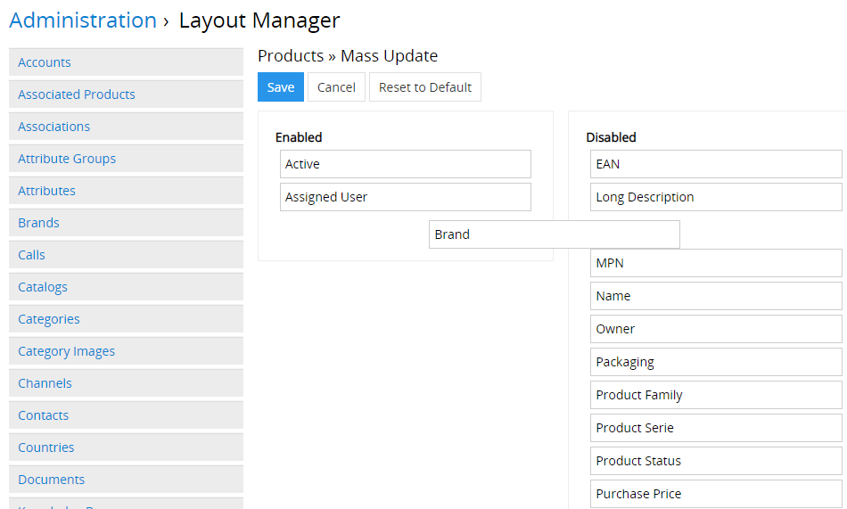
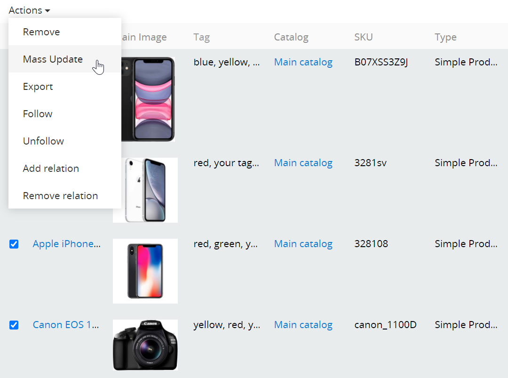
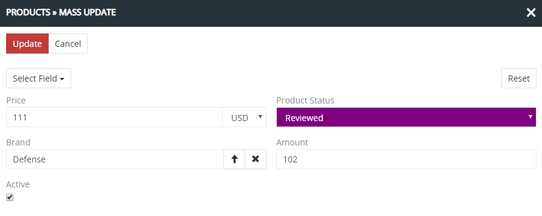
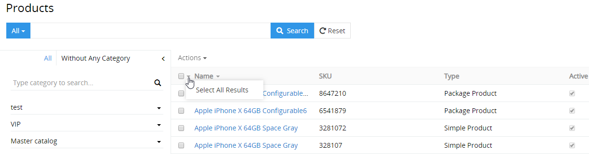
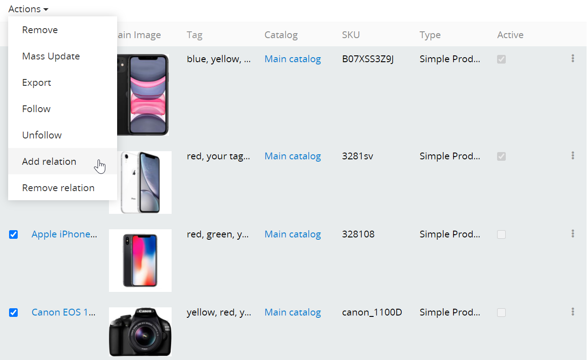

# Wie kann man die Produktinformationen schnell ändern?

Die Möglichkeit, die Produktinformationen schnell zu bearbeiten, zu vervollständigen und zu ändern ist in AtroPIM von großer Bedeutung. Außer den schnellen und bequemen Benutzeroberflächen ist im System die Möglichkeit vorgesehen, Massenänderungen vorzunehmen.

## Massenänderungen

Die Funktion `Mass Update` erlaubt, die Informationen von allen ausgewählten oder gefilterten Einträgen einer Entität gleichzeitig zu ändern.

Damit dies möglich ist, muss der Systemadministrator das im Adminbereich konfigurieren: `Administration` → `Layout Manager` → `Products` → `Mass Update` (für die Produkte). Mithilfe der Drag-and-Drop Funktion muss man benötigte Felder im Block `Enabled` platzieren und Änderungen speichern.

Für die Massenänderung der Produkte muss man sie in der Liste auswählen (mithilfe der Checkbox daneben) und im Action Menu auf `Mass Update` klicken.

Danach wird ein Popup für Update-Einstellungen von ausgewählten Produkten geöffnet. Im Feld `Select Field` muss man das Feld auswählen, das aktualisiert werden muss. Man kann die Werte von mehr als einem Feld gleichzeitig aktualisieren, was die Nutzung des Systems benutzerfreundlicher macht.

Nach dem Klicken auf den Button `Update` wird die Datenaktualisierung bei allen ausgewählten Produkten durchgeführt. Die Änderungen der Werte sind im Stream der entsprechenden Entität ersichtlich, falls es vorkonfiguriert wurde.

Um alle Entitätseinträge oder Filterergebnisse auszuwählen, muss man auf das Icon `▼` und dann auf `Select All Results` klicken. Als Ergebnis werden alle Einträge ausgewählt, und nicht nur die, die auf der Seite angezeigt sind. Wenn Sie nur auf die Checkbox klicken, werden nur die Einträge ausgewählt, die auf der Seite angezeigt sind.

## Aktualisierung mithilfe von Add/Remove Relation

Zusätzlich zu den Massenänderungen können AtroPIM-Anwender Beziehungen zwischen den Entitäten hinzufügen oder entfernen. Dafür gibt es im System die Funktionen `Add Relation` und `Remove Relation`.

Mithilfe von Add/Remove Relation kann man für Produkte Beziehungen zu den Einträgen der Entitäten Kategorien, Assoziierte Produkte, Kanäle hinzufügen und entfernen.

Im Feld `Select Entity` kann man nur die Entitäten auswählen, mit denen diese Entität eine Beziehung haben soll.

