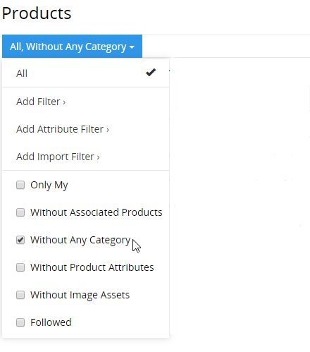
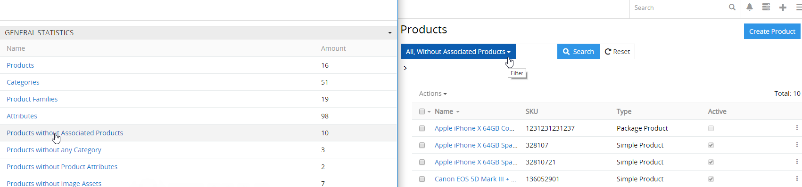
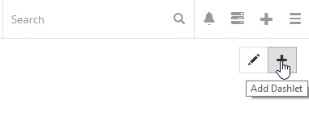

# Wie kann man unfertige Produkte schnell auswählen?

Wie man eine qualitative Produktbeschreibung erstellen kann, lesen Sie in dem Artikel [“Wie kann man vollständige und qualitative Produktbeschreibung in 6 Schritten erstellen” ](./produktbeschreibung-in-6-schritten.md).

Leider kann man in der Praxis ein Produkt nicht sofort von Anfang bis Ende beschreiben, da dieser Prozess nicht linear ist und es können gleichzeitig oder nacheinander mehrere Mitarbeiter daran teilnehmen. Deshalb benötigt jeder Anwender die Möglichkeit, die Produkte schnell auszuwählen, welche von seiner Seite qualitativ noch nicht ausreichend und noch zu bearbeiten sind. 

In AtroPIM gibt es verschiedene Möglichkeiten zur Auswahl der Produkte, deren Produktinformationen noch zu bearbeiten sind.

## Nutzung der Suchfunktion

Für die Suche nach notwendigen Produkten kann die Suchfunktion sehr nützlich sein. Dafür muss man auf der Suchleiste die Suchanfrage eingeben und auf den Suche-Button klicken. Man kann konfigurieren, über welche Produktfelder gesucht wird. Alle Produktattribute werden wohl automatisch durchsucht, dafür ist keine Konfiguration notwendig.

Wenn die Suchanfrage dem Produktnamen gilt, kann man vor oder nach dieser Anfrage ein Sternchen (Zeichen\*) einfügen. So, wenn man nach “name\*” sucht, werden die Produkte “name123” und “name35” angezeigt, und wenn nach “\*name” werden die Produkte “123name” und “35name” angezeigt.

## Nutzung von Filtern im AtroPIM

AtroPIM verfügt über flexible Filter mit folgenden Arten:

-   eingebaute Filter,
-   konfigurierte Filter.

Um Filter nutzen zu können, muss man das Menü mit Filtern links vom Suchfeld öffnen. Hier kann man auch benutzerdefinierte Filter speichern, nachdem die Filter eingestellt wurden.

Um konfigurierte Filter auszuwählen, muss man auf `Add Filter` klicken. Im Popup werden die Felder angezeigt, die im `Layout Manager` für Filterung konfiguriert sind. Um einen Filter hinzuzufügen, muss man die entsprechende Option auswählen und die benötigten Werte eingeben.

### Eingebaute Filter

Das sind folgende Filter:

-   `Without Associated Products` – alle Produkte anzeigen, die keine assoziierten Produkte haben
-   `Without Any Category` – alle Produkte anzeigen, die keiner Kategorie zugeordnet sind
-   `Without Product Attributes` – alle Produkte anzeigen, die keine Produktattribute haben
-   `Without Image Assets` – alle Produkte anzeigen, die keine Bilder haben

Bei Bedarf können auch neue kundenspezifische Filter zusätzlich programmiert werden.

Um einen eingebauten Filter auszuwählen, muss man die Checkbox neben dem benötigten Filter setzen, die Produkte werden automatisch gefiltert. Der Nutzer hat die Möglichkeit, nur die Produkte auszuwählen, die ihm zugewiesen sind, um z.B. bestimmte Änderungen vorzunehmen. Dafür muss man im Filter `Only My` auswählen.

### Konfigurierte Filter

Durch die Nutzung der Optionen `Add Filter` und `Add Attribute Filter` kann man beliebige Filter konfigurieren. Für die Datenfilterung muss man auf den Button `Search` klicken. Alle konfigurierten Filter können dann gespeichert werden.

## Nutzung von Dashboards

Für die schnelle Navigation zu Produkten, die noch zu bearbeiten sind, empfehlen wir auch, das Dashboard zu nutzen. Zur Bequemlichkeit kann man einstellen, dass auf dem Dashboard das Dashlet `General Statistics` angezeigt wird. Hier sind alle zusammengefassten Informationen über Ihre Produkte anzusehen. Auf diesem Dashlet werden auch die Informationen nach eingebauten Filtern angezeigt. Um die jeweiligen Produkte zu sehen, muss man einfach auf die entsprechende Position im Dashlet klicken.

Wenn Sie dieses Dashlet nicht haben, klicken Sie auf das Icon `✚` rechts oben auf der Dashboard-Seite, unter der Taskleiste.

## Nutzung von Status und anderer Felder von Typ Enum oder Multi-Enum

Beim Produkt gibt es das Feld `Product Status`, welches zeigt, inwiefern das Produkt zur Veröffentlichung vorbereitet ist. Jeder Systemnutzer kann eigene Status entsprechend seinem Produktworkflow konfigurieren. Diese Status stellen die Bereitschaft des Produktes oder den aktuellen Zustand der Beschreibung dar, falls es in Ihrem Produktworkflow vorgesehen ist.

Mittels Filterung nach Status kann jeder Nutzer verstehen, welche Informationen für gefilterte Produkte anzugeben sind. Für nähere Informationen über die Nutzung von Status und anderer Felder von Typ `Enum` oder `Multi-Enum` lesen Sie unseren Artikel [“Wie kann man die Workflows nutzen?“](wie-kann-man-die-workflows-nutzen.md).

Die Nutzung von Multi-Enum Felder, z.B. `Tags` ist ein sehr flexibles Tool für die Angabe bestimmter Produkt- oder Workflow-Besonderheiten. Die Filterung nach `Tags` ermöglicht es, Produkte nach einem bestimmten Merkmal zu filtern, um ihre Informationen zu vervollständigen.

Die Nutzung von Filtern nach `Tags` und `Status` (oder ähnlichen Feldern) hilft verschiedenen Mitarbeitern, ihre Arbeit schneller und qualitativer zu erledigen.

Die Nutzung von Enum und Multi-Enum Feldern erleichtert die Arbeit Ihrer Mitarbeiter und hilft, unvollständige, fertige und andere benötigte Produkte schneller zu finden.

## Nutzung von Werten Completeness

Wir empfehlen Ihnen, unser Modul Completeness zu nutzen, welches ermöglicht, den Ausfüllgrad von Pflichtfeldern zu kontrollieren. Für nähere Informationen über die Nutzung und Einstellung des Moduls lesen Sie die [Modulbeschreibung](https://atropim.com/de/shop/completeness).

Nach der Modulinstallation werden auf der Produktseite prozentuale Angaben über den Ausfüllgrad von Pflichtfeldern und Attributen angezeigt, bezogen auf jeden vorhandenen Kanal. Die Werte Completeness kann man ebenso auf der Seite mit der Produktliste ansehen, sie können auch als konfigurierte Filter genutzt werden. Dieses Modul vereinfacht Ihre Arbeit und spart Ihre Zeit.
