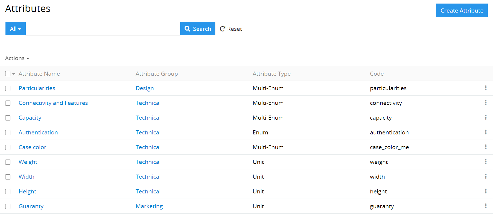
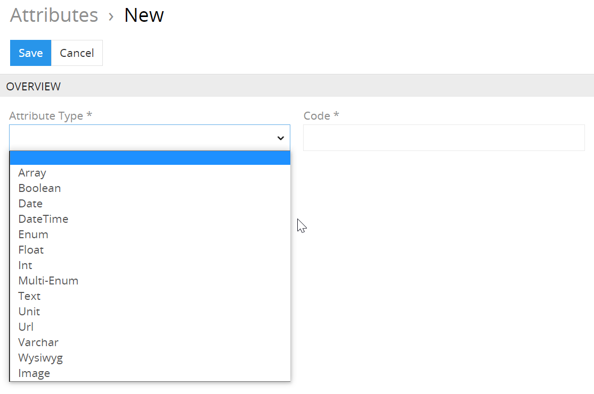
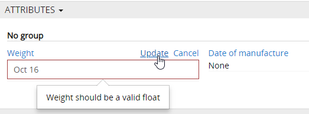
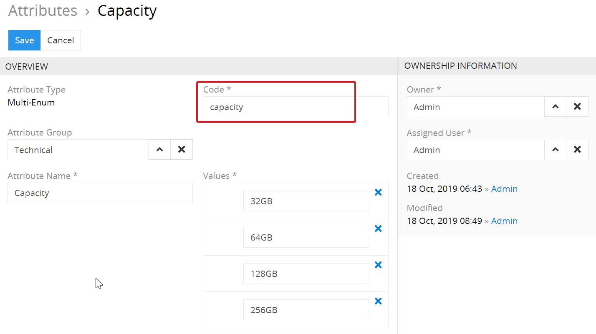
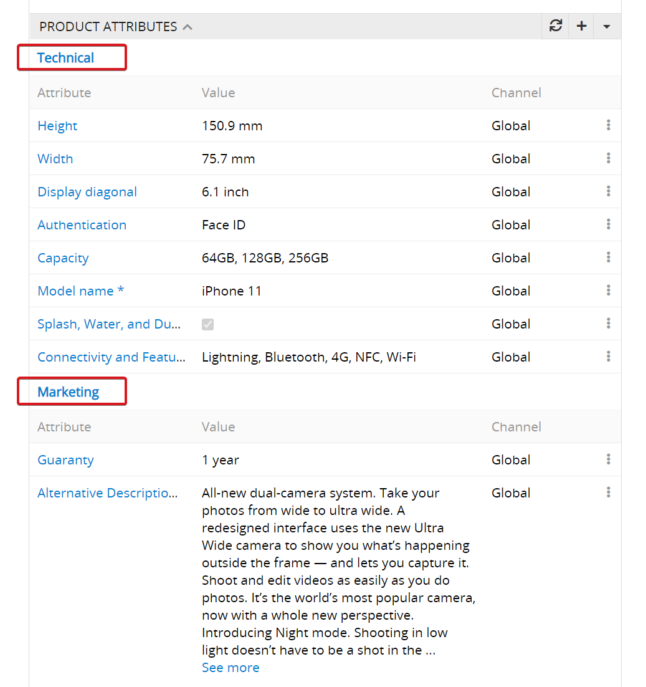
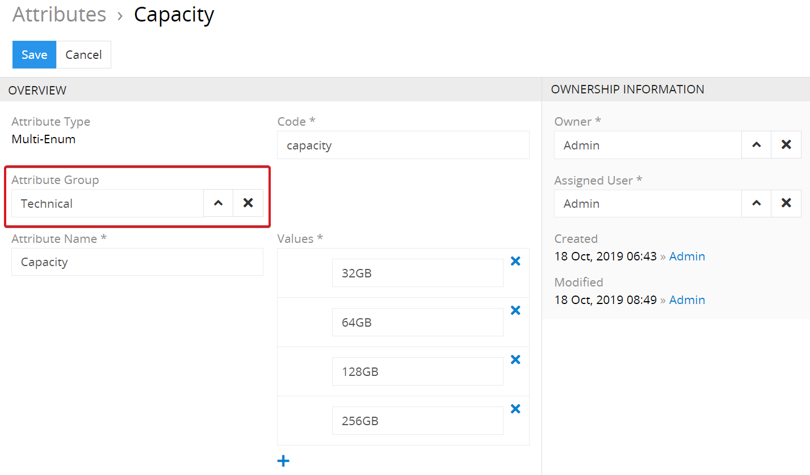
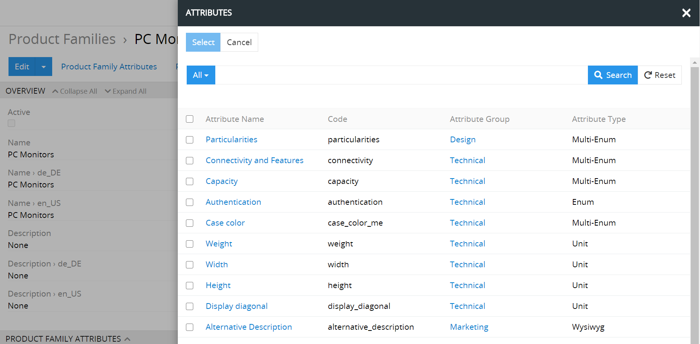
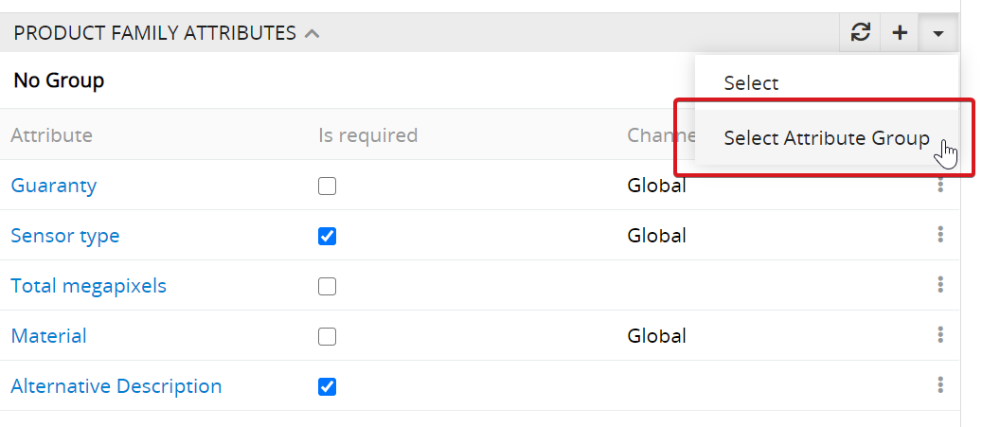
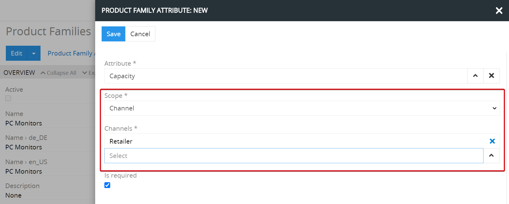
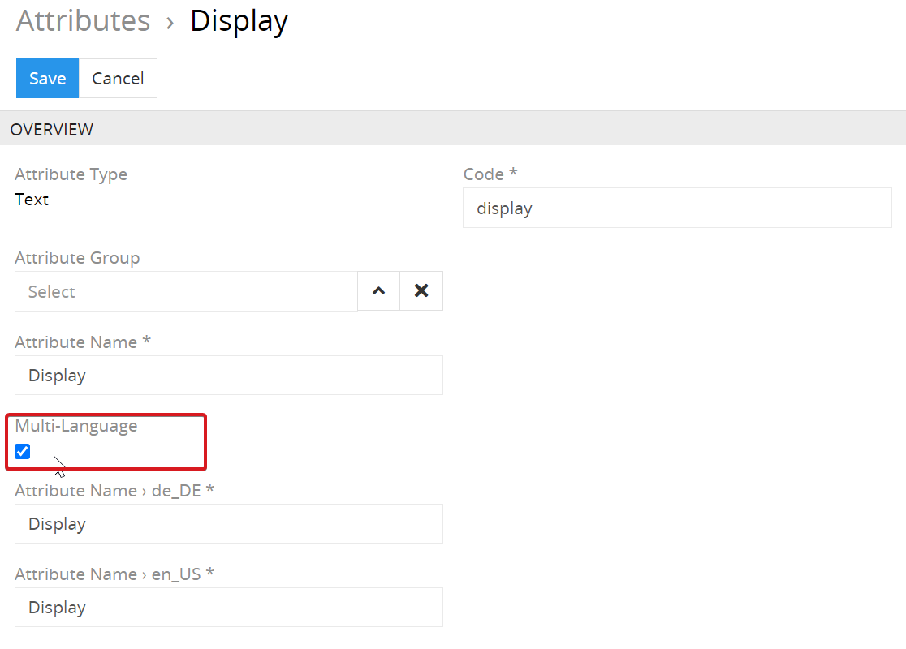

# Wie kann man die Produktattribute erstellen?

Das Produktattribut bestimmt eine gewisse Produkteigenschaft. Jedes Produkt kann mehrere Eigenschaften haben.

## Attributtypen

Im AtroPIM gibt es 14 Attributtypen und der Nutzer kann beliebige Anzahl von Attributen anlegen. Durch die Nutzung von Attributtypen können die Werte entsprechend den Nutzeranforderungen richtig validiert werden.

Mittels der Nutzung richtiger Attributtypen vermeiden Sie zufällige Fehler, die beim Eintragen der Daten auftreten können. Wenn Sie das Gewicht eintragen wollen, können Sie den Attributtyp `Float` nutzen. Dieser Attributtyp ermöglicht es, Zahlen mit Bruchteilen anzugeben. Wenn Sie aber ein Datum eintragen müssen, benötigen Sie einen anderen Attributtyp –  `Datum`. Wenn der Nutzer beim Eintragen der Daten einen Fehler macht und inkorrekte Daten eingibt, werden diese Daten vom System nicht gespeichert und es wird eine Fehlermeldung angezeigt.

## Attributcodes

Es kommt vor, dass man Attribute mit gleichen Namen für verschiedenartige Produkte verwenden muss. So ist z.B. das Attribut “Größe” für Schuhe nicht dasselbe wie das Attribut “Größe” für Oberbekleidung. Solche Attribute können sowohl von verschiedenen Typen sein, als auch verschiedene mögliche Werte haben. Um solche Attribute zu unterscheiden, kann man einen informativen Attributcode angegeben, der für jedes Attribut eindeutig sein sollte. Für oben angeführtes Beispiel könnten z.B. folgende Codes benutzt werden: size\_ footwear und size\_clothes.

Für nähere Informationen zu Attributen und ihren Typen lesen Sie die Dokumentation \[“Produktattribute”\] (/atrocore/atropim-docs/master/user-guide/attributes.md).

## Produktattributgruppen 

Die Produktattributgruppen können für die Gruppierung von gleichartigen Attributen genutzt werden. Somit sind alle Attribute anschaulich, besonders für den Fall, dass ein Produkt viele Attribute hat.

Die Nutzung von Produktattributgruppen ist nicht obligatorisch. Ein Attribut kann nur einer Attributgruppe zugeordnet werden.

Für nähere Informationen zu Attributen und ihren Typen lesen Sie die Dokumentation \[“Attributgruppen”\] (/atrocore/atropim-docs/master/user-guide/attribute-groups.md).

## Konfiguration der Attribute für Produktfamilien

Auf der Seite einer Produktfamilie kann man Attribute hinzufügen und bearbeiten, die zu der jeweiligen Produktfamilie gehören. Hier kann man entweder ein Attribut zusammen mit dessen Scope (Button `✚`) 

oder mehrere Attribute mit dem Scope `Global` hinzufügen (Button `▼`).

Man kann alle Attribute einer Attributengruppe auf einmal verlinken. Dafür sollte man im Attributenpanel eine entsprechende Option auswählen.

Die Attribute auf der Seite der Produktfamilie werden nach den Gruppen sortiert, wenn das Attribut keine Gruppe hat, wird dieser automatisch in der Gruppe `No Group` angezeigt.

Wenn ein Attribut ein Pflicht-Attribut ist, ist die Option `Is required` zu setzen.

## Kanalspezifische Attribute

Das System ermöglicht, kanalspezifische Attribute für Produktfamilien zu erstellen. Diese können einen Wert für einen spezifischen Channel erhalten.  Dafür ist der Scope `Channel` und ein entsprechendes Kanal oder Kanäle für ein Attribut auszuwählen.

Ein solcher Bedarf an kanalspezifischen Attributen kann aus verschiedenen Gründen bestehen:

-   Unterschiedliche Maßeinheiten oder Datentypisierung in verschiedenen Ländern.
-   Bedarf an unterschiedlichen Beschreibungen entsprechend den Marketing- oder SEO-Anforderungen.
-   Gesetzliche Anforderungen in bestimmten Ländern usw.

Kanalspezifische Attribute können mit den Produkten auch direkt verlinkt werden. Dafür sollte man ebenfalls den Button `✚` nutzen.

## Multisprachige / Multilokale Attribute

Es gibt die Möglichkeit, die ausgewählten Attribute als multilinguale Attribute zu setzen. Somit ist es einfach und bequem, die Übersetzungen von Produktbeschreibungen entsprechend den im AtroPIM aktivierten Lokalen zu verwalten.

Man kann folgende Attributtypen als multilinguale markieren: `Enum`, `Multi-Enum`, `Text`, `Varchar`, `Wysiwyg`.
