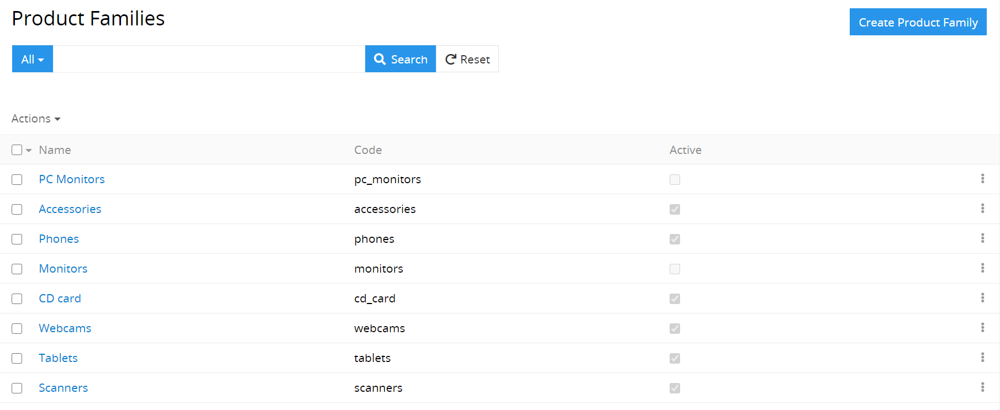

# Wie kann man die Produktfamilien erstellen?

Bei der Produkterstellung können die Produktfamilien genutzt werden. Die Produktfamilie bestimmt die Art des Produktes und bestimmt, mit welchen Pflicht- und optionalen Attributen das Produkt zu beschreiben ist. Gerade mithilfe der Produktfamilien können die Beschreibungen von gleichartigen Produkten vereinheitlicht werden. 

Nachdem eine Produktfamilie für ein Produkt angegeben ist, vererbt das Produkt automatisch alle Attribute der Produktfamilie. Fernseher  können beispielsweise als eine Produktfamilie gelten. Jeder Fernseher, der zu dieser Produktfamilie gehört, wird durch dieselben Attribute gekennzeichnet und kann mit diesen beschrieben werden – das sind z.B. Gewicht, Bildschirmgröße, Anschlussmöglichkeiten (Ports), Bildschirmtechnologie usw.

## Bestimmen Sie die notwendigen Produktfamilien

Wenn Sie gleichartige Produkte haben, reicht es, nur eine Produktfamilie zu nutzen. In diesem Fall ist es nötig, alle Attribute, die solche Produkte beschreiben, zu dieser Produktfamilie hinzuzufügen.

Wenn Sie die Produkte verschiedener Arten haben und für diese ausführlichere Beschreibungen vorbereiten möchten, reicht es jedoch nicht, nur eine Produktfamilie zu nutzen. Jeder Anwender hat eigene Besonderheiten und kann die Produktfamilien je nach eigenen Bedürfnissen und der Bereitschaft, die Zeit für Vorbereitung qualitativer Produktbeschreibungen aufzuwenden, einrichten. 

Man muss auch Folgendes berücksichtigen – je mehr Produktfamilien erstellt werden, desto schwieriger ist deren Verwaltung, andererseits aber ermöglichen sie, mehr qualitative und ausführliche Produktbeschreibungen zu erstellen. Sie haben beispielsweise einen Onlineshop für Mode. Für diesen Onlineshop können drei große Hauptproduktfamilien erstellt werden: Kleidung, Schuhe und Accessoires. Die Standardattribute für Kleidung sind: Größe, Farbe, Stoff, Saison; für Schuhe: Größe, Farbe, äußerer Stoff, innerer Stoff; für Accessoires: Farbe, Material. 

Der Detaillierungsgrad von Produktfamilien beeinflusst direkt den Detaillierungsgrad und Qualität der Produktbeschreibungen, die zu diesen Familien gehören. Weniger detaillierte Gruppen müssen mit einer größeren Anzahl an optionalen Attributen konfiguriert werden. Das kann dazu führen, dass ein wichtiges Attribut nicht angegeben werden kann und folglich hinzugefügt werden muss. So z.B., wenn man eine Jacke der Produktfamilie “Oberbekleidung” zuordnet, und es ist notwendig, für diese Jacke den “Ausschnitttyp” anzugeben, kann man dieses Attribut zur Produktfamilie “Oberbekleidung” nur als optionales Attribut hinzufügen, denn es gibt unter Oberbekleidung unbedingt die Produkte ohne Ausschnitt. Ob ein solcher Kompromiss wirklich nötig ist, muss jeder Anwender selbst entscheiden.

Produktfamilien können nicht nur dafür genutzt werden, um die Attribute für gewisse Produkte zu bestimmen, sondern auch als ein zusätzliches Mittel für Segmentierung Ihrer Produkte. Eine solche Segmentierung kann später für Massenaktionen und bei der Arbeit mit dem Produktkatalog verwendet werden. 

## Wie kann man eine neue Produktfamilie erstellen?

Vor der Erstellung einer neuen Produktfamilie muss man sich überzeugen, dass diese wirklich erforderlich ist, um keine Duplikate zu erstellen. 

Für die Erstellung einer neuen Produktfamilie sind folgende Pflichtfelder anzugeben: 

-   `Name` – der Name der Produktfamilie.
-   `Code` – der innere Code der Produktfamilie, der eindeutig ist. Es dürfen nur Ziffern, Kleinbuchstaben und der Unterstrich genutzt werden.

Wir würden empfehlen, die Produktfamilien eindeutig und aussagekräftig zu benennen, damit eindeutig erkennbar ist, welche Attribute dort verwendet werden.

Wenn Sie Produktfamilien mit gleichen oder ähnlichen Namen benennen, können Sie im Feld `Description` ausführlich beschreiben, worin der Unterschied liegt und für welche Produkte eine bestimmte Produktfamilie verwendet werden kann. Bei der Arbeit kann man diese Familien nach dem Code unterscheiden, weil dieser eindeutig ist. 

Bei der Erstellung neuer Produktfamilien kann man die bestehende Produktfamilie duplizieren, dabei werden alle Attribute der Produktfamilie mit kopiert.

Unnötige Attribute können aus der Produktfamilie nach ihrer Erstellung entfernt werden, die neuen werden hinzugefügt. Die Nutzung dieser Option ermöglicht es, viel Zeit bei der Systemkonfiguration zu sparen.

Wenn Sie beispielsweise eine neue Kleidungskollektion bekommen haben, bei der ein neues Attribut, z.B. “Stil”, genutzt werden sollte, das bei den alten Kollektionen nicht vorhanden war, können Sie eine neue Produktfamilie “Kleidung New” basierend auf der Produktfamilie “Kleidung” erstellen und dieses Attribut der neuen Produktfamilie als Pflichtattribut hinzufügen.

Für nähere Informationen zur Konfiguration der Attribute, die zu einer bestimmten Produktfamilie gehören müssen, lesen Sie den Artikel  \[“Wie kann man die Produktattribute erstellen?”\] (https://wwwwwwwwwwwww).
