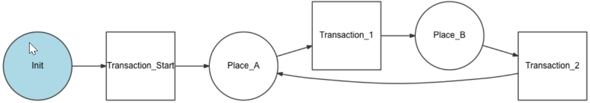
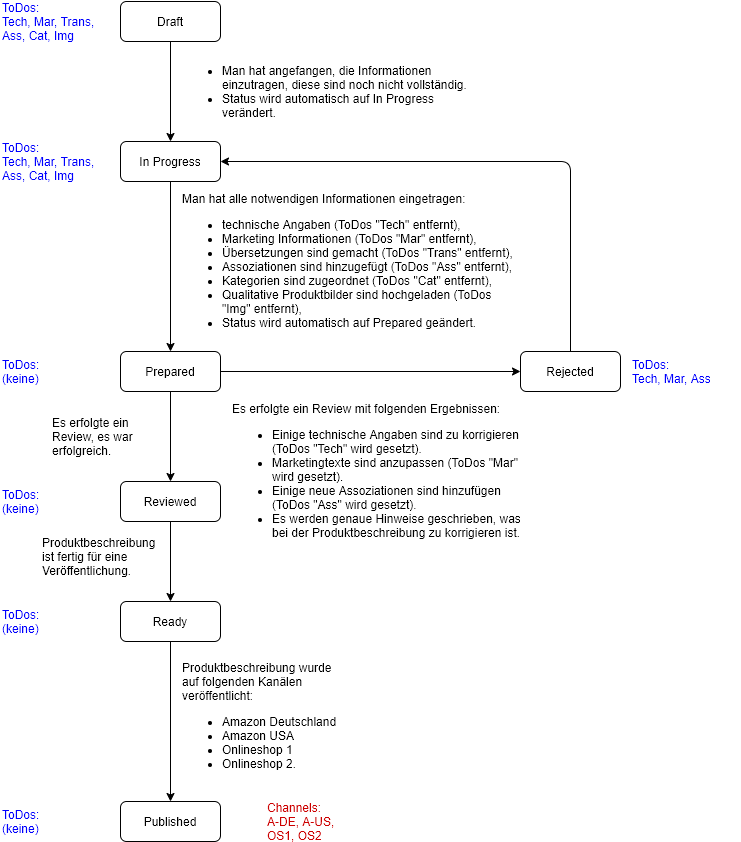
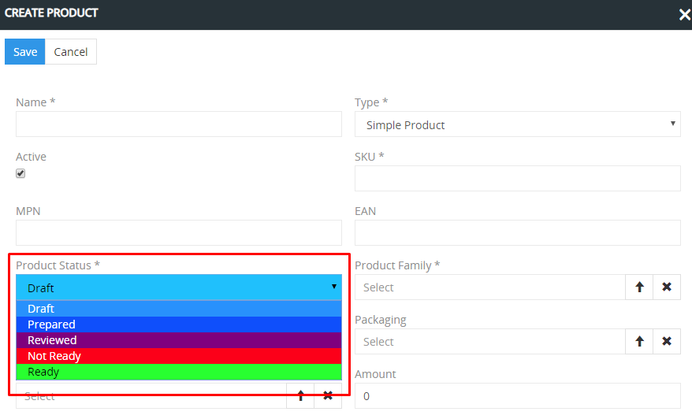
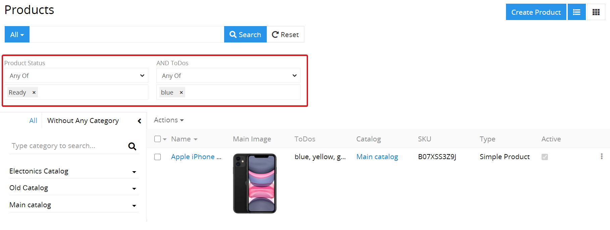
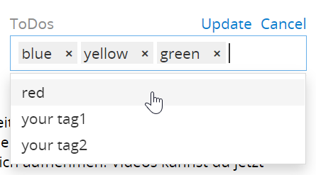

# Wie  kann man die Workflows nutzen?

Die Erstellung der qualitativen und vollwertigen Produktbeschreibungen erfordert einen großen Zeitaufwand – sowohl intern, als auch extern – von beteiligten Agenturen und Freelancern (Copywritern, Fotografen, SEO-Spezialisten). Alle Beteiligten können ihre Aufgaben sowohl parallel als auch nacheinander erledigen, deshalb ist die richtige Organisation des Arbeitsprozesses und der Zusammenarbeit zwischen den Beteiligten sehr wichtig, damit diese Arbeit schnell, qualitativ und effektiv erledigt wird. 

Unter einem Workflow verstehen wir die aufeinanderfolgende und parallele Erfüllung bestimmter Aufgaben, die zur Erreichung eines Zustandes (dies kann z.B. der Produktstatus sein) führen. Ein Workflow besteht somit aus Zuständen und Übergängen zwischen ihnen. Erfolgt der Übergang, wird ein neuer Zustand erreicht. Jeder Anwender von AtroPIM kann seine spezifischen Bedürfnisse mithilfe von Workflows umsetzen. Beliebige Arbeitsprozesse können damit abgebildet werden.

 

Für die Automatisierung der Workflow-Prozesse bieten wir ein spezielles Workflows Modul, das auf der [Symfony Workflow Komponente](https://symfony.com/doc/current/components/workflow.html) basiert. Aktuell werden die notwendigen Workflows auf dem Niveau der Programmierung erstellt. Mit der Zeit werden wir die Konfiguration von Workflows über die Benutzeroberfläche ermöglichen.

AtroPIM ist ein sehr flexibles System für die Organisation der Workflows, dabei können auch die Berechtigungen von einzelnen Users berücksichtigt werden. In diesem Artikel erklären wir, wie man den Prozess der Vorbereitung von Produktbeschreibungen mithilfe der Felder von Typ `Enum` (Auswahlliste) und `Multi-Enum` (mehrfache Auswahlliste) abbilden kann.

## Lebenszyklus der Vorbereitung eines Produktes zur Veröffentlichung

Bevor ein Produkt veröffentlicht werden kann, soll seine Beschreibung einen bestimmten Lebenszyklus durchlaufen.  So kann jeder Anwender einen eigenen Workflow und einen eigenen Lebenszyklus für die Erstellung von qualitativen Produktbeschreibungen haben.  Das Ziel ist es also, das Workflow maximal schnell zu durchlaufen.

In unserem Beispiel betrachten wir ein einfaches Workflow, das für die Mehrheit der Anwender passen wird. Bei Bedarf kann es  verändert oder ergänzt werden.  In dem Workflow werden folgende Felder genutzt:

-   `Produktstatus` (von Typ `Enum`) – um den Workflowzustand abzubilden.
-   `ToDos` (von Typ `Multi-Enum`) – um die noch offene Aufgaben abzubilden.
-   `Channels` (von Typ `Multi-Enum`) – um die Kanäle zu markieren, über welche die Produktbeschreibung bereits veröffentlicht ist.

Aus dem Flowchart ist es ersichtlich, dass der übliche Workflow-Ablauf folgendermaßen aussieht: Draft → In Progress → Prepared → Reviewed → Ready → Published. Falls beim Review festgestellt wird, dass irgendetwas mit den Produktdaten nicht in Ordnung ist, wird der Produktstatus auf `Rejected` gesetzt. Alle möglichen Übergänge sind mithilfe von Pfeilen markiert.

Die Kollegen, die an der Vorbereitung der Produktinformationen arbeiten, können die Felder `Produktstatus` und `ToDos` als Filter nutzen, um für sich schnell eine Übersicht zu bekommen, an welchen Produkten noch etwas zu tun ist. Man kann die Produkteinträge auch zuweisen, um festzuhalten, wer aktuell “am Ball” ist.

In dem Feld `Channels` sollte es festgehalten werden, über welche Kanäle die Produktbeschreibung publiziert worden ist.

Man kann zusätzlich programmieren, dass bei einem gewissem Ereignis eine automatische Handlung von System vorzunehmen ist; so kann man z.B. programmieren, dass wenn der Produktstatus auf `Prepared` gesetzt wird, das Produkt dem Reviewer automatisch zugeordnet wird. Dieser wird darüber von System automatisch informiert, falls es so eingestellt ist. Beliebige andere Automatisierungen sind ebenso denkbar.

Denkbar ist auch die Änderung der Berechtigungen der Benutzer in Abhängigkeit vom Status. So sollte z.B. die Mehrheit der Mitarbeiter das Produkt nicht mehr editieren können, wenn es den Status `Ready` hat.

## Nutzung des Feldes Produktstatus

`Product Status` ist ein Feld des Typs `Enum`, das vorkonfigurierte Werte im System hat. Diese Werke können von einem Administrator geändert werden.

Je nach Anforderungen des Anwenders kann das Feld unterschiedlich genutzt werden. Wir würden empfehlen, dieses Feld für die Anzeige des Zustandes eines Produktes zu nutzen.

Bei der Erstellung des Produktes wird ihm standardmäßig der Status `Draft` zugeordnet. Den Standardstatus kann der Administrator ändern. Der Wert des Status kann automatisch oder manuell geändert werden, fall der Nutzer die entsprechenden Berechtigungen dafür hat.

Im System sind folgende Product Status standardmäßig eingerichtet:

-   `Draft` – das Produkt ist neu erstellt,
-   `Prepared` – die Produktbeschreibung ist vorbereitet,
-   `Reviewed` – die Produktbeschreibung ist überprüft,
-   `Not Ready` – die Produktbeschreibung muss weiter bearbeitet werden,
-   `Ready` – die Produktbeschreibung ist bereit für die Veröffentlichung. 

Der Produktstatus hilft dabei, den Prozess der Vorbereitung von Produktbeschreibungen zu kontrollieren.

Mit den Filtern kann jeder Nutzer nach dem entsprechenden Status die Produkte auswählen, an denen Beschreibungen er arbeiten muss. So kann der Mitarbeiter, der die Beschreibungen überprüfen muss, Produkte nach dem Status `Prepared` filtern und sie überprüfen – die anderen Produkte werden ihn nicht stören. Die Mitarbeiter, die die Produktbeschreibungen vorbereiten müssen, können die Produkte nach dem Status `NOT Ready` filtern. 

Für die Filterung nach einem bestimmten Status muss man in den Filtern `Product Status` auswählen, den entsprechenden Wert eingeben und auf den Suchbutton klicken. Um die Filtereinstellungen zurückzusetzen, muss man auf den Button `Reset` klicken – somit werden alle Filter- und Sortierungseinstellungen zurückgesetzt. Wenn es nötig ist, nur einen von einigen Filtern zu entfernen, muss man auf `x` neben dem nötigen Filter und nachher auf den Button `Search` klicken. 

Der Administrator kann die verfügbaren Statuswerte und ihre Anordnung im `Entity Manager` ändern. Wir würden empfehlen, nicht zu viele Status zu erstellen, sondern die für die wichtigsten Zustände der Vorbereitung Ihrer Produktbeschreibungen. Die Statuswerte sollen eindeutig sein – somit vermeiden Sie Probleme mit der Kontrolle der Vorbereitung von Produkten zur Veröffentlichung und Verwirrung unter den Mitarbeitern. 

## Nutzung des Feldes ToDos

`ToDos` ist ein Feld vom Typ `Multi-Enum`. Im Unterschied zu den Werten des Feldes `Status`, von denen das Produkt zu einem bestimmten Zeitpunkt nur einen haben kann, kann das Feld `ToDos` mehrere Werte zugleich haben, die zueinander nicht konkurrierend sind. Eine Beschreibung kann beispielsweise nur technische Angaben, oder nur Marketing-Angaben oder beides haben.

Diese Werte können an eine bestimmte Phase des Workflows angebunden sowie auch völlig unabhängig davon sein. Wenn z.B. die Produktbeschreibung  vorbereitet ist (Status: `Prepared`), müssen alle Werte im Feld `ToDos` entfernt werden. Das Feld `ToDos` kann z.B. den Wert `Zu taggen` beinhalten, der bedeutet, dass dieses Produkt noch mit Tags zu versehen ist.

`ToDos` sind bei der Produktbeschreibung behilflich, weil sie den Zustand der Produktbeschreibung ausführlicher als der Produktstatus charakterisieren.

Die Nutzer können die Produkte nach `ToDos` filtern. Dafür muss man das Feld `ToDos` bei den Filtern auswählen und in diesem Feld die Werte eingeben, nach denen gesucht werden muss, und auf den Suchbutton klicken. 

Wenn das Feld `ToDos` bei den Filtern nicht angezeigt wird, soll der Administrator seine Anzeige als Filter einstellen. Der Administrator kann die Liste und Anordnung der möglichen ToDos-Werte ändern. Wir würden empfehlen, nicht zu viele Werte zu erstellen und diesen maximal kurze Namen zu geben, damit diese nicht zu viel Platz einnehmen. Es ist empfehlenswert, wenn möglich die Abkürzungen zu nutzen, die Namen müssen maximal eindeutig sein. 

Die Multi-Enum Felder helfen den Nutzern, sich leichter in der großen Menge von Produkten zu orientieren und ihre Arbeit schnell und zielorientiert zu erledigen, ohne viel Zeit auf die Suche nach Produkten mit nicht qualitativen oder fehlerhaften Beschreibungen aufzuwenden. 

## Nutzung von zusätzlichen Feldern

Im System kann man beliebige zusätzliche Felder erstellen, die den Nutzern helfen, die Arbeit an den Produktbeschreibungen zu organisieren. Die besten Typen von diesen Feldern sind `Enum` (Auswahllisten) und `Multi-Enum` (mehrfache Auswahllisten).

Im vorgeschlagenen Workflow empfehlen wir, das Feld `Channels` des Typs `Multi-Enum` zu erstellen, um die Informationen zu speichern, auf welchem Kanal die entsprechende Beschreibung veröffentlicht wurde. 

Der Administrator kann zusätzliche Felder erstellen und für diese die Werte vorgeben.
