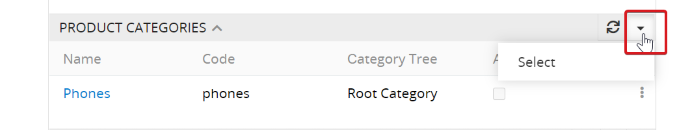
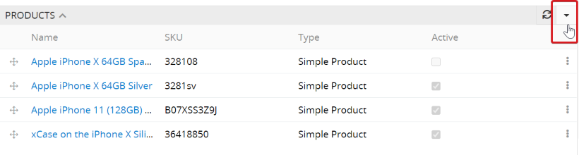
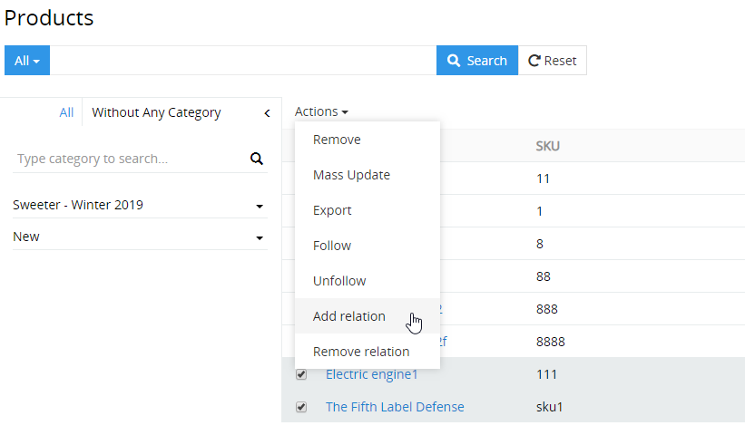

# How to categorize the products?

Customers search for the desired products in the online shops and marketplaces in two ways: via the search function or via the categories and sub-categories. The product attributes are used for an additional filtering of the products that were found in the first or second way. The faster the customer finds the desired product, the more likely he will make a positive purchase decision, that is why a correct categorization is of great importance. For marketing purposes, each product is usually assigned to one or more categories.

Before product categorization, you have to make sure that all necessary categories have been created and that existing category trees are assigned to the corresponding catalogs so that these categories can be used for the products from these catalogs.

## Select categories for products

To assign the product to one or more categories, click on the `▼` icon in the `Product Categories` panel and then click on` Select`. In the opened popup you have to select the required categories and click on the `Select` button. It is a good idea to refer to the category code as the category names of different trees can be duplicated.

The product is automatically assigned to the channels to which the category tree of the selected category is assigned.

## Select products for categories

You can add new products to a category directly on the category page. To do this, click on the `▼` icon in the `Category Products` panel and select all the products that should be added.

## Mass addition, change or decoupling of the categories for selected products

On the product list page, you can add or delete a relationship to several categories at the same time for selected products (e.g. after filtering) thanks to the `Add Relation` and` Remove Relation` functions.

To do this, click on `Add Relation` or` Remove Relation`, select `Product Categories` in the opened popup in the ` Select Entity` field and then the necessary categories. As a result, the relationship from the selected category to the preselected products is added or deleted.

