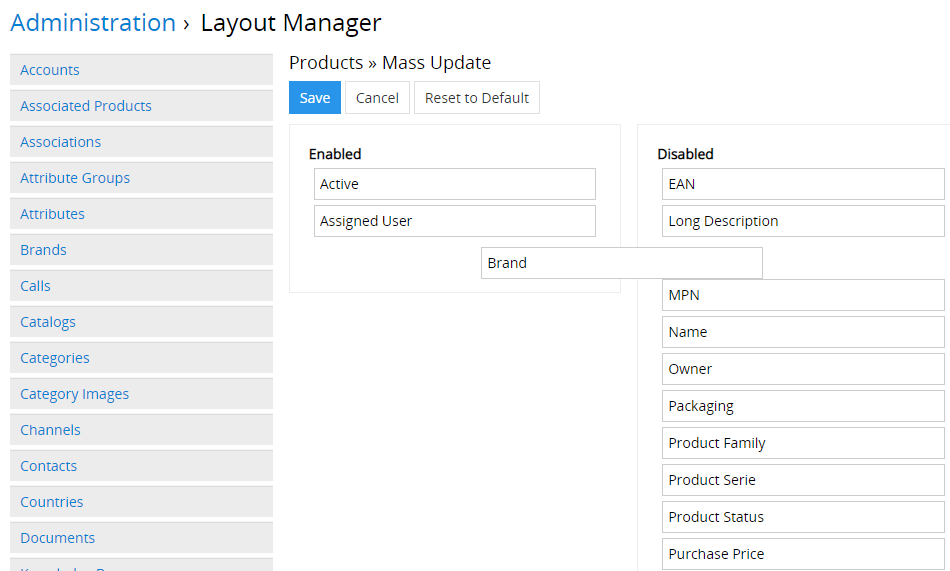
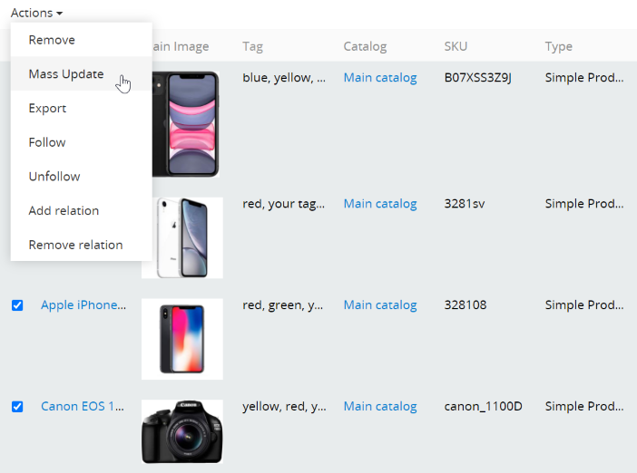
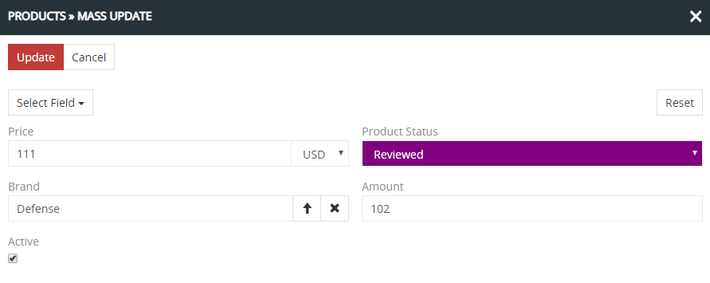
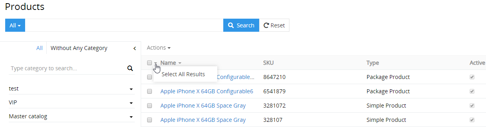
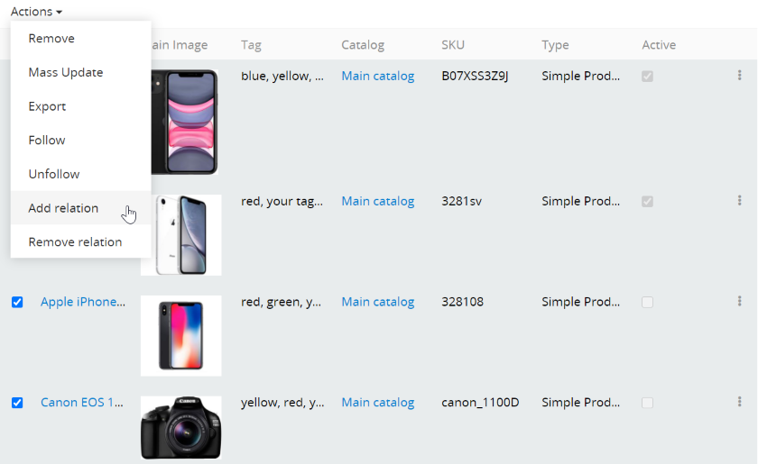
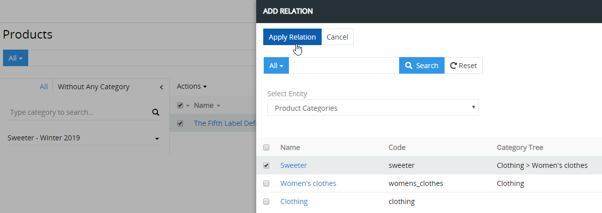

# How to change the product information quickly?

The ability to quickly edit, complete and change the product information is very important in AtroPIM. In addition to the quick and convenient user interfaces, the system provides the option of making mass changes.

## Mass changes

The `Mass Update` function allows the information of all selected or filtered entries of an entity to be changed at the same time.

In order for this to be possible, the system administrator must configure this in the admin area: `Administration` →` Layout Manager` → `Products` →` Mass Update` (for the products). Using the drag-and-drop function, you have to place the required fields in the `Enabled` block and save changes.

To mass change the products, you have to select them in the list (using the checkbox next to it) and click on `Mass Update` in the Action Menu.

A popup for update settings for selected products will then open. In the field `Select Field` you have to select the field that needs to be updated. You can update the values ​​of more than one field at the same time, which makes the system more user-friendly.

After clicking the `Update` button, the data will be updated for all selected products. The changes to the values ​​can be seen in the stream of the corresponding entry, if it has been pre-configured.

To select all entity entries or filter results, click on the `▼` icon and then on `Select All Results`. As a result, all entries are selected, not just those that are displayed on the page. If you just click on the checkbox, only the entries that are displayed on the page will be selected.

## Update using Add / Remove Relation

In addition to the mass changes, AtroPIM users can add or remove relationships between the entities. The system has the functions `Add Relation` and` Remove Relation` for this purpose.

Using Add / Remove Relation, you can add and remove relationships for products to the entries of the categories, associated products, and channels.

In the field `Select Entity` you can only select the entities with which this entity should have a relationship.

