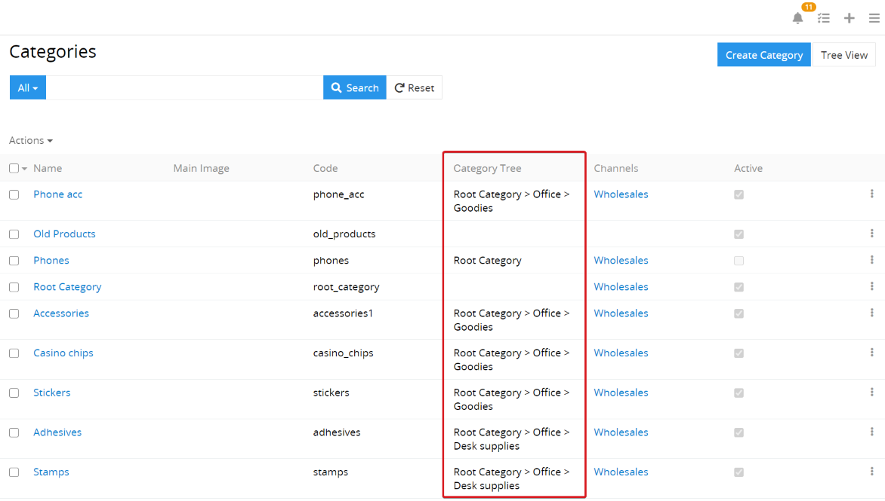
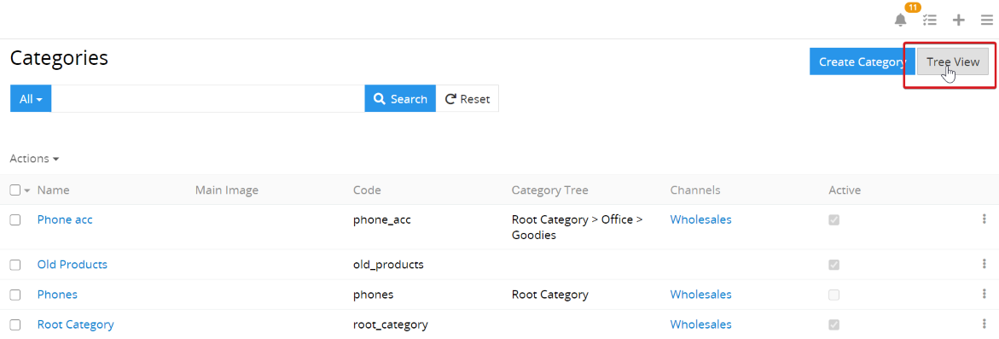
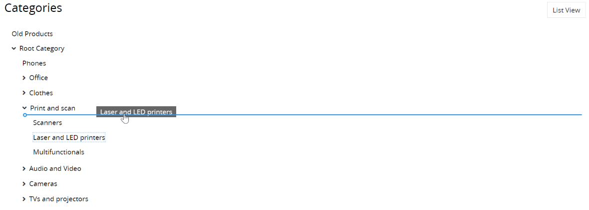

# How to configure the categories?

With the help of the categories, the end customer can find the required product faster. A good example of the product categories are the categories in any online shop. Since the category is for marketing purposes only, the product can be assigned to more than one category so that it will be displayed more frequently.

## Category tree

Only one parent category can be entered for each category. With the help of such links, a category tree is created; the category without a parent category is the root category, the category without child categories is called a leaf category. The child categories of a certain category are called sub-categories.

If several root categories are created for the categories, the user will work with several category trees.

In the view of a category tree (view `Tree View`) you can clearly see all available category trees.

Using the drag-and-drop function, you can quickly make changes to the structure of any tree.

For better usability and acceleration of the customer journey, we recommend not creating more than 3 category levels. Of course, every user has their own specific needs, but one has to consider the following: the simpler the category tree, the more likely it is that the customer will find exactly what they are looking for.

## Categories that are created based on product properties

The creation of the categories can often be based on product properties, which are usually to be described by product attributes. 

Example 1:

So you can create the category "TV" and add the following sub-categories to this category: 

- TV 32 "
- TV 42 "
- TV 52 ”.

It is advisable to relieve the category tree of superfluous sub-categories and instead add the “Diagonal” attribute to the product family and specify the appropriate value for each TV set. An important advantage of using attributes is the ability to filter the entries. If the user uses the filtering by attributes, he will find the required product faster than if he only uses the categories and sub-categories.

So everyone has to find the golden mean for themselves, where the categories end and the attributes begin.

The following rules apply when creating the categories: 

- It can be set whether a category that has sub-categories can have products.
- A category with products cannot be set as a parent category for any other category if the products can only be assigned to the leaf categories.
- A category cannot be removed if it has sub-categories.
- A panel with products that belong to this category is displayed on the category page.
