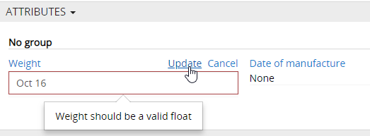

# How to create the product attributes?

The product attribute determines a certain product property. Each product can have many properties.

## Attribute types

In AtroPIM there are 14 attribute types and the user can create any number of attributes. By using attribute types, the values ​​can be correctly validated according to user requirements.

By using the correct attribute types, you avoid accidental errors that can occur when entering the data. If you want to enter the weight, you can use the attribute type `Float`. This attribute type enables numbers to be specified with fractions. But if you need to enter a date, you need a different type of attribute - `Date`. If the user makes a mistake while entering the data and enters incorrect data, this data will not be saved by the system and an error message will be displayed.

## Attribute codes

It happens that you have to use attributes with the same name for different products. For example, the “size” attribute for shoes is not the same as the “size” attribute for outerwear. Such attributes can be of different types as well as have different possible values. In order to distinguish such attributes, an informative attribute code can be given, which should be unique for each attribute. For the example above, the following codes could be used: size\_ footwear and size\_clothes.

For more information on attributes and their types, read the documentation [“Product Attributes”](/atrocore/atropim-docs/master/user-guide/attributes.md).

## Product attribute groups 

The product attribute groups can be used to group similar attributes. This way all attributes are vivid, especially when a product has many attributes.

The use of product attribute groups is not mandatory. An attribute can only be assigned to one attribute group.

For more information on attributes and their types, read the documentation [“Attribute Groups”](/atrocore/atropim-docs/master/user-guide/attribute-groups.md).

## Configuration of the attributes for product families

On the product family page, you can add and edit attributes that belong to the respective product family. Here you can either enter an attribute together with its scope (button `✚`)

or add several attributes with the scope `Global` (button ` ▼ `).

You can link all attributes of a certain attribute group at once. To do this, you should select an appropriate option in the attribute panel menu.

The attributes on the product family page are sorted according to the groups, if the attribute has no group, it is automatically displayed in the group `No Group`.

If an attribute is a mandatory attribute, the option `Is required` should be set.

## Channel-specific attributes

The system enables channel-specific attributes to be created for product families. These can be given a value for a specific channel. For this purpose, the scope `Channel` and a corresponding channel for an attribute must be selected.

Such a need for channel-specific attributes can exist for various reasons:

- Different units of measurement or data typing in different countries.
- Need for different descriptions according to marketing or SEO needs.
- Legal requirements in certain countries etc.

Channel-specific attributes can also be linked directly to the products. You should use the `✚` button for this.

## Multi-language / multi-local attributes

It is possible to set the selected attributes as multilingual attributes. This makes it easy and convenient to manage the translations of product descriptions according to the locations activated in AtroPIM.

You can mark the following attribute types as multilingual: `Enum`,` Multi-Enum`, `Text`,` Varchar`, `Wysiwyg`.
