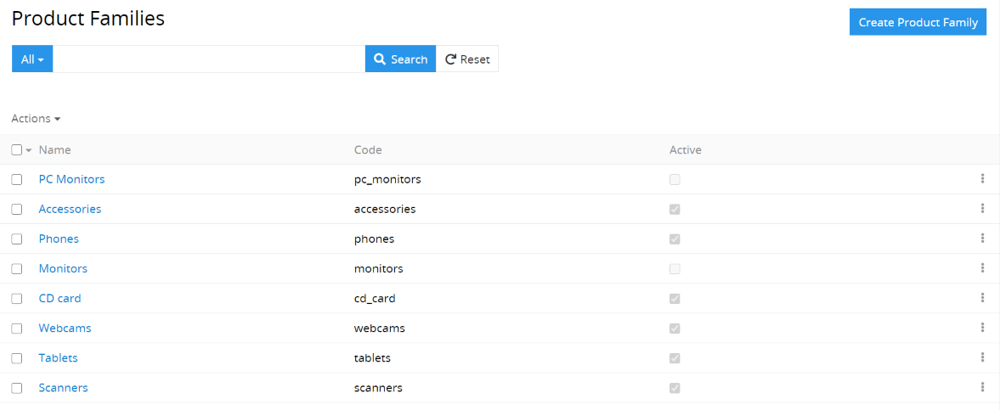
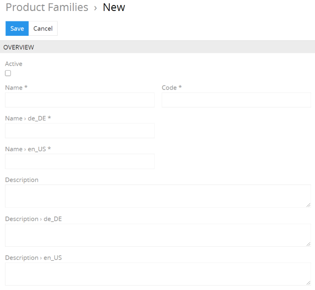
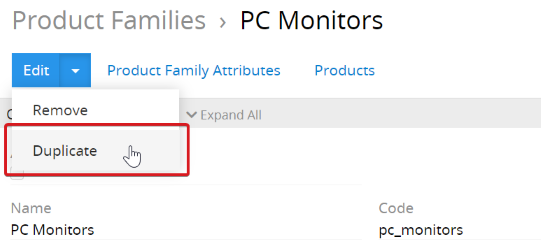

# How to create the product families?

The product families can be used when creating a product. The product family determines the type of product and determines the mandatory and optional attributes with which the product is to be described. The descriptions of similar products can be standardized with the help of the product families.

After a product family has been specified for a product, the product automatically inherits all attributes of the product family. For example, televisions can be considered a family of products. Every television that belongs to this product family is identified by the same attributes and can be described with these - for example, weight, screen size, connection options (ports), screen technology, etc.

## Determine the necessary product families

If you have similar products, it is sufficient to only use one product family. In this case, it is necessary to add all attributes that describe such products to this product family.

However, if you have the products of different types and want to prepare more detailed descriptions for them, it is not enough to use just one product family. Each user has their own special features and can set up the product families according to their own needs and the willingness to spend the time preparing high-quality product descriptions.

One must also consider the following - the more product families that are created, the more difficult it is to manage them, but on the other hand they allow the creation of more qualitative and detailed product information. For example, you have an online fashion shop. Three major main product families can be created for this online store: clothing, shoes, and accessories. The standard attributes for clothing are: size, color, fabric, season; for shoes: size, color, outer fabric, inner fabric; for accessories: color, material.

The level of detail of product families directly influences the level of detail and quality of the product descriptions that belong to these families. Less detailed groups must be configured with a greater number of optional attributes. This can mean that an important attribute cannot be specified and therefore has to be added. For example, if you assign a jacket to the “Outerwear” product family and it is necessary to specify the “Neckline” for this jacket, you can only add this attribute to the “Outerwear” product family as an optional attribute, because under Outerwear there is necessarily the products without a cutout. Each user has to decide for himself whether such a compromise is really necessary.

Product families can not only be used to determine the attributes for certain products, but also as an additional means of segmenting your products. Such a segmentation can later be used for mass actions and when working with the product catalog.

## How can you create a new product family?

Before creating a new product family, you have to convince yourself that it is really necessary in order not to create duplicates. 

The following mandatory fields are required to create a new product family: 

- `Name` - the name of the product family.
- `Code` - the inner code of the product family, which is unique. Only numbers, lowercase letters and the underscore may be used.

We would recommend naming the product families clearly and meaningfully so that it is clear which attributes are used there.

If you name product families with the same or similar names, you can describe in detail in the `Description` field what the difference is and for which products a particular product family can be used. At work, you can distinguish these families by the code because it is unique.

When creating new product families, the existing product family can be duplicated; all attributes of the product family are copied as well.

Unnecessary attributes can be removed from the product family after they have been created, the new ones are added. Using this option allows you to save a lot of time in system configuration.

For example, if you have received a new clothing collection that should use a new attribute, eg “Style”, which was not available in the old collections, you can create a new product family “Clothing New” based on the product family “Clothing” and add this attribute to the new product family as a mandatory attribute.

For more information on the configuration of the attributes that must belong to a certain product family, read the article [“How to create the product attributes?”](Https: // wwwwwwwwwwwww).
