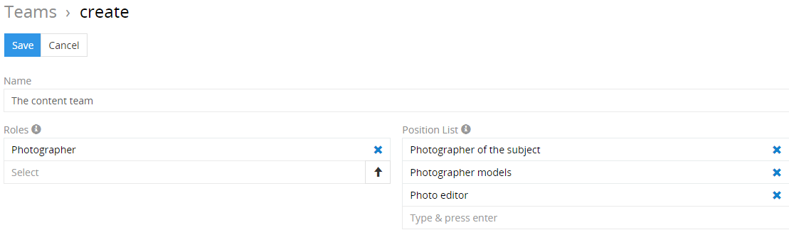
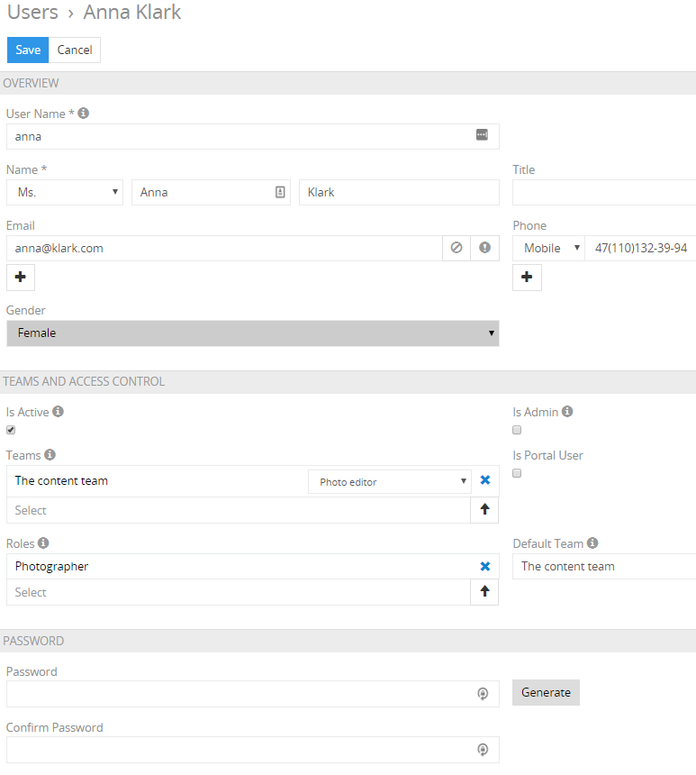
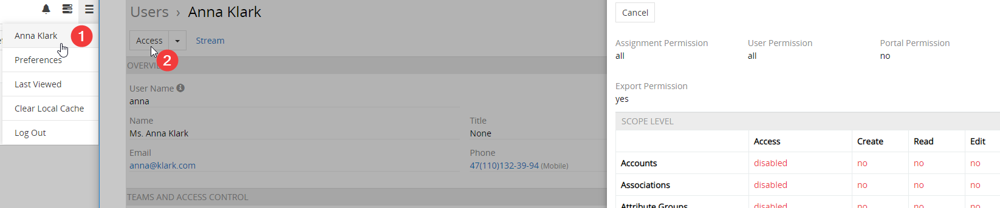
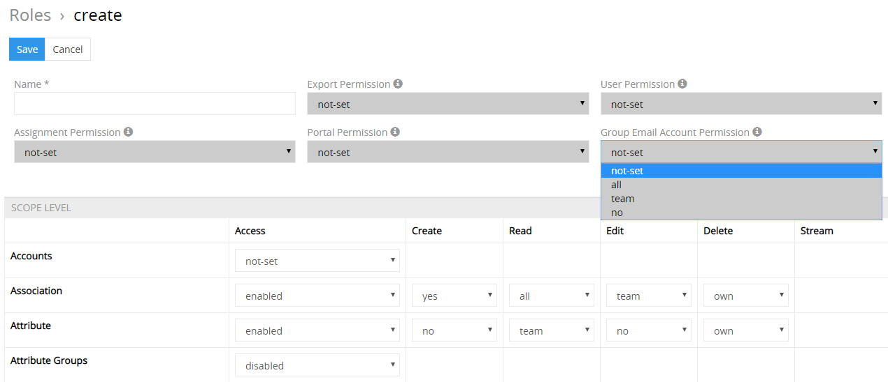
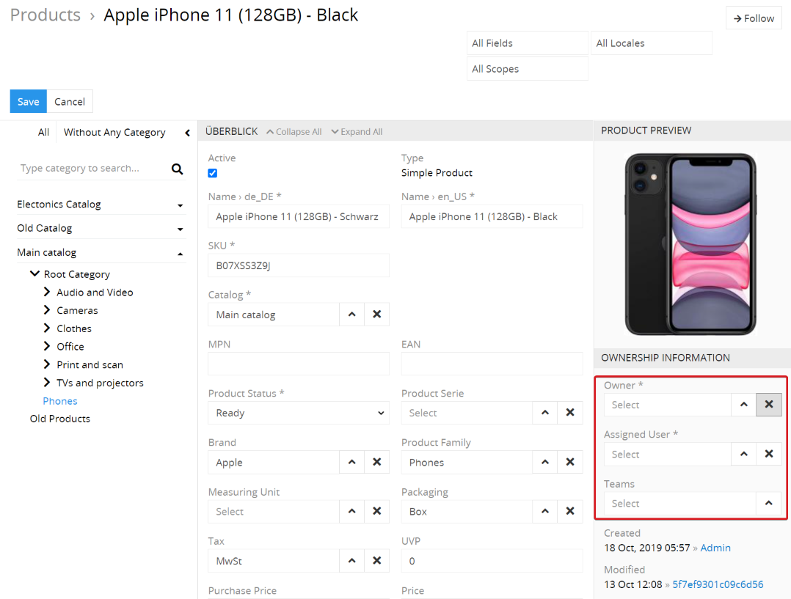
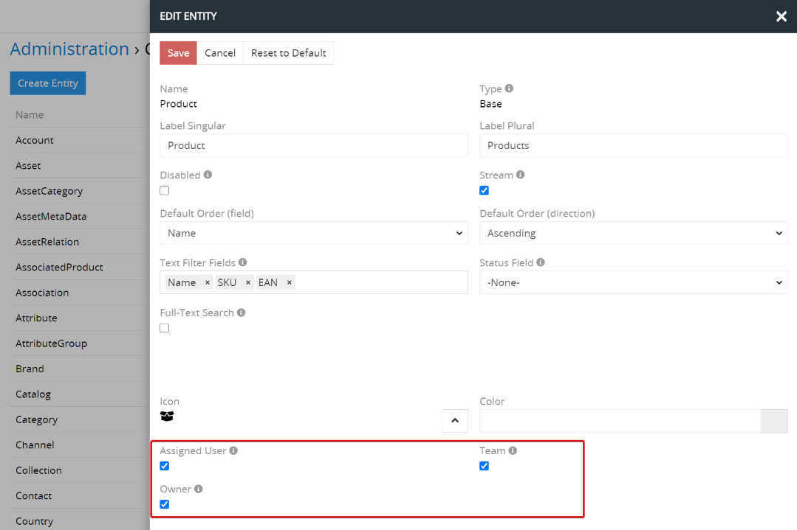
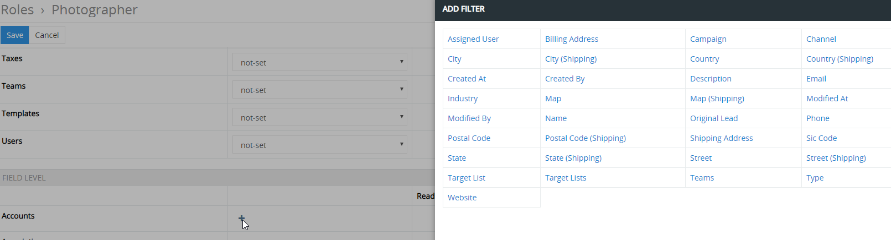

# How to organize effective teamwork?

Our PIM software offers good opportunities for efficient collaboration, both internally between employees and with external agencies or freelancers. The company can have its own product managers who prepare technical product descriptions. However, external experts can also be used to create good marketing or SEO texts and professional product images.

For this reason, the effective design of teamwork in a PIM system is of great importance both for the quality of the work results and for the speed of their achievement.

Access to the system can be granted both directly and via the portal functionality, which can be configured and used for a specific purpose. Examples of the use of portals are supplier portals and dealer portals.

An important specialty of AtroPIM is the possibility to manage the access not only to individual entities and their entries, but also at the field level.

## ACL Strict Mode

By default, the `not-set` option is specified for access permissions for each entity, which means that access to this entity has not yet been configured. If `ACL Strict Mode` (in` Administration` → `Settings`) is activated, the user has no access rights by default if the access is not configured. If `ACL Strict Mode` is not activated, the user has access to all entities for which his authorizations are not configured. We would recommend activating `ACL Strict Mode` immediately after installing the system.

## Roles, users and teams at a glance

AtroPIM has a very flexible access control system based on roles, teams and users. The authorizations are configured individually for each role. You can set the permissions for both standard and custom entities individually.

A PIM user is an account for system access for a specific person. The user is assigned one or more roles that determine his or her authorizations in the system. A role can be assigned to one or more users.

Each user can belong to one or more teams. Each team can contain several users.

## Use of teams

Teams are created to connect people who have the same duties, work on the same project, or are responsible for a specific region. Each user can belong to several teams at the same time.

To create a team, the administrator has to go to `Administration` →` Teams` → `Create Team`.

The creation of qualitative product descriptions requires cooperation between different teams and employees.

In order for the user who belongs to a certain team to have access to a certain entry, he must have access to this entity at the team level. This team must be assigned to this entry. Additional programming is required so that teams are automatically assigned to entries according to certain characteristics.

A correct setting gives your employees and teams access only to the entities and fields that they need to carry out their tasks. This enables the work of your employees to be optimally organized and their efficiency increases.

## Use of users

In order to have access to the system, the user needs his own account. The user can be assigned the role of 'Administrator'. In this case, he receives the highest access level with maximum permissions.

Each user can be assigned specific roles and the user himself can be assigned to specific teams. In order to be as flexible as possible, the user can have several roles and belong to several teams at the same time.

To create a new user, the administrator has to go to `Administration` →` Users` and click on the button `Create User`. 

Users should have access to the data and functions in the system that they need to fulfill their official duties.

Every PIM user can view and edit the data of their own account (if such authorizations are set for the role) and change the password. You can also see which permissions the user has, depending on which roles are assigned to him. For this you have to click on `Access` in the settings of the personal account. It should be mentioned that the user receives the sum of all permissions for his roles.

Example:

Roles 1 and 2 are assigned to the user.

With role 1 he has access and authorizations to entities A and B. With role 2 he has access and authorizations to entities B and C. Since the user is assigned both roles, he receives access and authorizations to entities A, B and C.

## Use of roles

A new role can be created by the administrator:

`Administration` →` Roles` → `Create Role`

When creating a role, the authorizations for `Create`,` Read`, `Edit`,` Delete` and `Stream` must be set for the required entities.

### Authorizations and access levels

You can set up the authorizations for the following actions in the system:

- Сreate
- Read
- Edit
- Delete
- Stream

The access level can be set for each authorization. For example, it can be set that users can only edit their own entries, entries from their own teams to which they belong, or all entries in the system. The following access levels can be set:

- `all` - the user has access not only to his own entries, but also to the entries of all other users.
- `team` - the user has access to the entries created by the users of the teams to which he belongs. 
- `own` - the user has access to his own entries.
- `no` - the user has no access rights.

The authorizations of a user with regard to the entries in the system are recorded using their ownership information:

If the user is set as the owner or assigned user of an entry, he has access to this entry if his access level is `own` or higher for this entity (e.g. products).

An entry can be assigned directly to one or more teams, so all users who belong to these teams have access to this entry if their access level is `team`.

For each entity in the system you can activate or deactivate the possibility to assign `Teams`,` Assigned User` and `Owner` to this entity.

To do this you have to go to `Administration` →` Еntity Manager`, open the required entity and click on `Edit`. Then you have to tick the checkbox `Team`,` Assigned User` or `Owner` and save the changes.

To better understand how permissions and access levels are determined, let's look at the following examples.

#### Example 1:

If it is necessary that the translator can translate the relevant product attributes, the one should

- Create the role `Translator`.
- Create the user for the translator in the system and assign the role `translator` to this user.
- Set this role the authorization `Edit` for the entity product attribute by selecting the access level ` own`.
- Make sure that the translator is set as an assigned user for all attribute entries for translations.
- Enabling the translator to read all the product attributes so that they can see the values ​​to be translated.

#### Example 2:

You have the following teams:

- General Product Team - this includes Marc, Andrea, John.
- New Catalog Team - this includes Marc, Andrew, Bill.

You have roles with the following access level for editing:

- Сopywriter - оwn
- Product Manager - team
- Photographer - own
- Marketing Manager - own

The following roles are assigned to the users:

- Marc - Product Manager
- Andrea - Copywriter
- John - Product Manager
- Andrew - Photographer
- Bill - Marketing Manager

There are the following products in the system:

- Electric engine b124e

- the specified Team "New Catalog Team"

- Assigned User: Andrea

- Owner: -

  

- Electric engine c212f

- the specified Team "New Catalog Team"

- the specified Team "General Product Team"

- Assigned User: Andrew

- Owner: -

The authorizations to edit the product “Electric engine b124e” are given accordingly: 

- Marc - because he belongs to the team that is specified for this product and the role assigned to him has access to editing at the `team` level. 
- Andrea - because she is an assigned user for this product and the role assigned to her has access to editing on the `own` level. 

The authorizations to edit the product “Electric engine c212f” are given accordingly:

- Marc - because he belongs to the team that is specified for this product and the role assigned to him has access to editing at the `team` level.
- Andrew - because he is an Assigned User for this product and the role assigned to him has access to editing on the `own` level.
- John - because he belongs to the team specified for this product and the role assigned to him has access to editing on the `team` level.

Although the user Bill belongs to the team that is specified for both products, these products are not displayed to him because the role assigned to him only has access to editing at the `own` level.

### Field level permissions

AtroPIM offers among other things the possibility to configure the access rights on the field level of a certain entity. To do this, when editing the role on the `Field Level` panel, click on the` ✚` icon after the relevant entity. A popup is opened with the fields belonging to this entity. After selecting the field, you can set access to read or edit this field by specifying `yes` or` no` for the required action.

 

This function is necessary if the user needs access to certain entries, but is not allowed to change the values ​​in other fields (e.g. to avoid accidental changes) or to see them. This function is particularly useful when different people are responsible for filling in various fields. For example, if you have an employee who only needs to enter technical details on the product page, it is advisable to restrict his permissions to edit the `SKU` or` Product Status` fields.

Before setting the role, you must carefully and thoroughly analyze which tasks a particular user has to perform and which access rights he should be given.

For the `Delete` authorization, it is advisable not to set the access level higher than` own` - to avoid that the user deletes the entries that were not added by him.

Correct role settings make it possible to reduce the number of errors in the system, ensure data security and avoid accidental changes by users who are not supposed to have permissions to do so. The general rule that you should adhere to when configuring roles is as follows: You only have to set the authorizations and access for the user to the entities and their fields to which he needs access to fulfill his official duties.
