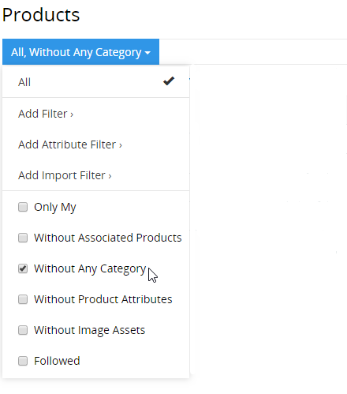

# How to select unfinished products quickly?

You can read how to create a qualitative product description in the article [“How to create a complete and qualitative product description in 6 steps”](./product-description-in-6-steps.md).

Unfortunately, in practice, it is not possible to describe a product immediately from start to finish, as this process is not linear and several employees can take part in it simultaneously or one after the other. Therefore every user needs the possibility to quickly select the products which on his part are not yet of sufficient quality and which can still be processed.

In AtroPIM there are various options for selecting the products whose product information is still to be edited.

## Use of the search function

The search function can be very useful for finding the products you need. To do this, you have to enter the search query in the search bar and click on the search button. You can configure which product fields are to be searched. All product attributes will be searched automatically, no configuration is necessary.

If the search query applies to the product name, you can insert an asterisk (\*) before or after this query. So if you search for “name \*” it will show products “name123” and “name35”, and if after “\* name” it will show products “123name” and “35name”.

## Use of filters in AtroPIM

AtroPIM has flexible filters of the following types:

- built-in filters,
- configured filters.

To use filters, you have to open the menu with filters to the left of the search field. You can also save custom filters here after the filters have been set.

To select configured filters, click on `Add Filter`. The fields that are configured for filtering in the `Layout Manager` are displayed in the popup. To add a filter, you have to select the appropriate option and enter the required values.

### Built-in filters

These are the following filters:

- `Without Associated Products` - show all products that have no associated products
- `Without Any Category` - show all products that are not assigned to any category
- `Without Product Attributes` - show all products that have no product attributes
- `Without Image Assets` - display all products that have no images

If necessary, new customer-specific filters can also be programmed.

In order to select a built-in filter, you have to set the checkbox next to the required filter, the products will be filtered automatically. The user has the option of selecting the products that are assigned to him, for example to make certain changes. For this you have to select `Only My` in the filter.

### Configured filters

Using the options `Add Filter` and` Add Attribute Filter` you can configure any filter. For data filtering you have to click on the `Search` button. All configured filters can then be saved.

## Use of dashboards

For quick navigation to products that still need to be edited, we also recommend using the dashboard. For convenience, you can set the dashboard to display the `General Statistics` dashlet. All summarized information about your products can be viewed here. The information according to built-in filters is displayed on this dashlet. To see the respective products, you simply have to click on the corresponding position in the dashlet.

If you don't have this dashlet, click the `✚` icon in the top right corner of the dashboard, below the taskbar.

## Use of status and other fields of type enum or multi-enum

The product has the `Product Status` field, which shows the extent to which the product is prepared for publication. Each system user can configure their own status according to their product workflow. These statuses represent the readiness of the product or the current state of the description, if it is provided for in your product workflow.

By filtering by status, each user can understand what information needs to be provided for filtered products. For more information about the use of status and other fields of type `Enum` or ` Multi-Enum` read our article [“How can you use the workflows?“](./how-to-use-the-workflows.md).

The use of multi-enum fields, e.g. `Tags`, is a very flexible tool for specifying certain product or workflow characteristics. Filtering by `tags` makes it possible to filter products according to a certain characteristic in order to complete their information.

The use of filters by `tags` and ` status` (or similar fields) helps different employees to do their work faster and more qualitatively.

The use of `Enum` and `Multi-Enum` fields makes the work of your employees easier and helps to find incomplete, finished and other required products faster.

## Use of values completeness

We recommend that you use our Completeness module, which enables you to check the degree to which mandatory fields have been filled in. For more information about the use and setting of the module, read the [module description](https://atropim.com/de/shop/completeness).

After the module has been installed, percentage information about the degree of completion of mandatory fields and attributes is displayed on the product page, for on each existing channel. The completeness values can also be viewed on the product list page; they can also be used as configured filters. This module simplifies your work and saves your time.
