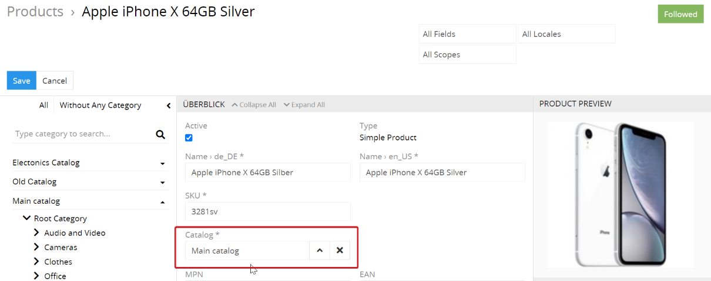
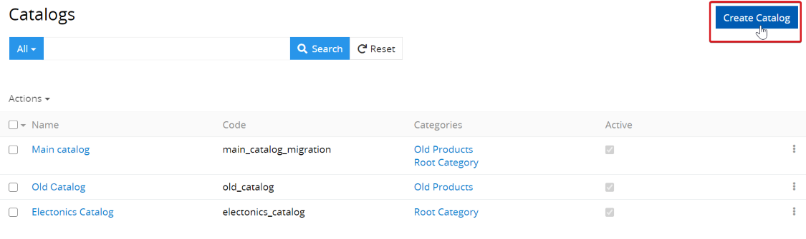
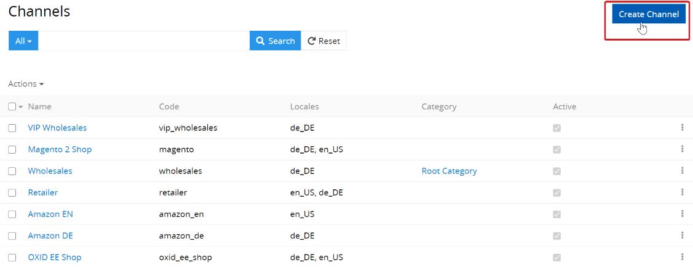
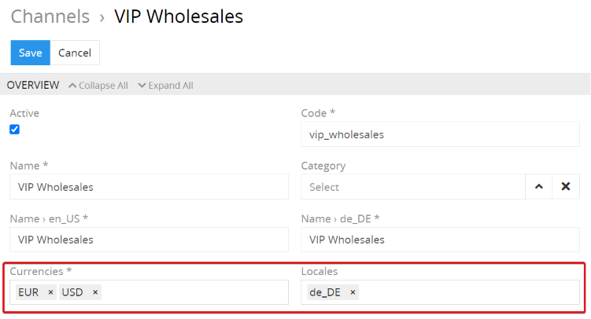

# How to properly use the catalogs and channels?

Catalogs and channels form the basis for multichannel publication of your product information. They enable you to manage the product range and implement your own multichannel strategy as flexibly as possible.

A catalog is the assortment of products that are grouped according to a certain characteristic, for example if you have a new clothing collection. Products are assigned directly to the catalogs.

 

Channels are final destinations for your product information. Products can be assigned to the channels directly or indirectly via the product categories. The indirect assignment takes place via the assignment of the category tree to which the category belongs to a channel. A category tree can be assigned to several channels at the same time. In this case, the product is assigned to all these channels accordingly.

Online shops, marketplaces, apps, print catalogs and other applications can be considered to be channels. All channel-specific product information that is specified for this channel, as well as general product information that is common to all channels, is transferred to a specific channel.

## Creation of catalogs

To create a new catalog, you have to go to the entity page of the catalogs and click on the `Create` button.

Each user can set the structure of catalogs according to his requirements. Catalogs can be used to segment the product range, to export the product information for corresponding channels and to save historical product information, e.g. for the creation of the catalogs of clothing and shoe collections from the suppliers: "Jackets Autumn-Winter 2017", “Jackets Fall-Winter 2018”. The name of the catalog should be given in such a way that it is immediately clear which products it contains, or the name of the channel can be given - so it is clear what this catalog is for.

## Creation of channels

To create a new channel, click on the "Create" button on the channels page.

To limit the amount of product information that is passed through a channel, you can also specify when setting up the channel:

- Local - so that the descriptions are transferred in certain languages.
- Currencies - so that only prices in certain currencies are transferred.

### Storage of multilingual (multi-locale) product information

Channels can have regional connections, since the product information can be used in different languages ​​for different countries. There are multilingual fields and product attributes in AtroPIM for this purpose. The product information in different languages ​​can be entered in the system regardless of which channels this product is assigned to.

### What are channel-specific attributes used for?

In some cases, channels have to take into account regional specificities or legal requirements regarding the descriptions of certain products. In addition, in some cases it may be necessary to specify different values ​​for product attributes, e.g. different product names, because certain platforms may have restrictions on the length of the name, or descriptions of various lengths, or even different descriptions. In addition, different units of measurement can be used in different countries, so attribute values ​​must be specified in corresponding units of measurement.

In AtroPIM this is possible thanks to the use of channel-specific attributes. In order to use them, you have to specify when configuring the product families which attribute must be channel-specific.

## Use of channels for transferring product information

In AtroPIM, the information for various channels can be transferred in the following ways:

- Via AtroPIM REST API
- Via API of another system, if a corresponding connector is developed by AtroPIM
- Via export feeds

If a channel is set for data transfer via API, this channel can also be used for data export via export feeds.
