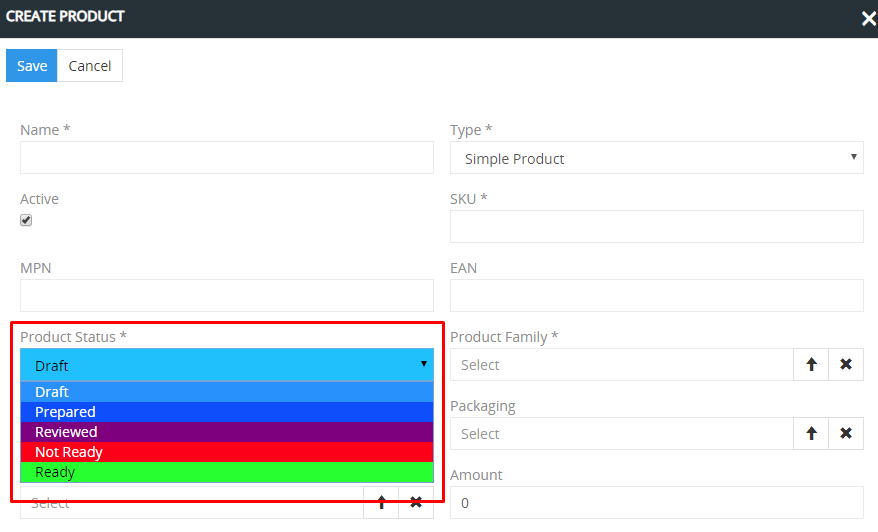

# How to use the workflows?

The creation of the qualitative and full-fledged product descriptions requires a large amount of time - both internally and externally - from the employees, from the agencies and freelancers involved (copywriters, photographers, SEO specialists). All participants can do their tasks in parallel as well as one after the other, so the correct organization of the work process and the cooperation between the participants is very important so that this work is done quickly, qualitatively and effectively.

We understand a workflow to be the successive and parallel fulfillment of certain tasks that lead to the achievement of a certain state (this can be the product status, for example). A workflow therefore consists of states and transitions between them. If the transition occurs, a new state is reached. Every user of AtroPIM can implement his specific needs with the help of workflows. Any work processes can be mapped with it.

 

For the automation of the workflow processes we offer a special workflow module, which is based on the [Symfony Workflow Component](https://symfony.com/doc/current/components/workflow.html). The necessary workflows are currently being created at the programming level. Over time, we will allow workflows to be configured through the user interface.

AtroPIM is a very flexible system for organizing workflows, and the authorizations of individual users can also be taken into account. In this article we explain how the process of preparing product information can be done using the fields of type `Enum` (selection list) and` Multi-Enum` (multiple selection list).

## Life cycle of preparing a product for publication

Before a product can be published, its description should go through a certain life cycle. Every user can have their own workflow and life cycle for creating qualitative product descriptions. The goal is therefore to run through the workflow as quickly as possible.

In our example we consider a simple workflow that will suit the majority of users. If necessary, it can be changed or supplemented. The following fields are used in the workflow:

- `Product status` (of type ` Enum`) - to map the workflow state.
- `ToDos` (of type` Multi-Enum`) - to map the tasks that are still open.
- `Channels` (of type` Multi-Enum`) - to mark the channels through which the product description is already published.

The flowchart shows that the usual workflow is as follows: Draft → In Progress → Prepared → Reviewed → Ready → Published. If the review reveals that something is wrong with the product data, the product status is set to `Rejected`. All possible transitions are marked with arrows.

The colleagues who are working on the preparation of the product information can use the `Product Status` and ` ToDos` fields as filters to quickly get an overview of which products still need to be done. You can also assign the product entries to keep track of who is currently “on the ball”.

In the `Channels` field it should be noted via which channels the product description was published.

You can also program that an automatic action is to be taken by the system in the case of a certain event; for example, you can program that if the product status is set to `Prepared`, the product is automatically assigned to the reviewer. The system will automatically inform the user if this is the case. Any other automation is also conceivable.

It is also conceivable to change the authorizations of the users depending on the workflow state. For example, the majority of employees should no longer be able to edit the product if it has the product status `Ready`.

## Use of the product status field

`Product Status` is a field of type ` Enum` that has pre-configured values ​​in the system. These can be changed by an administrator.

The field can be used differently depending on the requirements of the user. We would recommend using this field to display the status of a product.

When the product is created, it is assigned the status `Draft` by default. The administrator can change the default status. The value of the status can be changed automatically or manually, if the user has the appropriate authorizations.

The following product statuses are set up by default in the system:

- `Draft` - the product is newly created,
- `Prepared` - the product inofrmation is prepared,
- `Reviewed` - the product information has been checked,
- `Not Ready` - the product information must be edited further,
- `Ready` - the product information is ready for publication. 

The product status helps to control the process of preparing product information.

With the filters, each user can select the products on which descriptions he has to work on according to the corresponding status. The employee who has to check the descriptions can filter products by the status `Prepared` and check them. The employees who have to improve the product descriptions can filter the products by status `NOT Ready`.

For filtering according to a certain status you have to select `Product Status` in the filters, enter the corresponding value and click on the `Search` button. To reset the filter settings, you have to click the `Reset` button - this will reset all filter and sorting settings. If it is necessary to remove only one of some filters, you have to click on `x` next to the required filter and then on the button ` Search`.

The administrator can change the available status values ​​and their arrangement in the `Entity Manager`. We would recommend not creating too many statuses, but rather those for the most important states in the preparation of your product descriptions. The status values ​​should be clear - this will avoid problems with controlling the preparation of products for publication and confusion among employees.

## Use of the ToDos field

`ToDos` is a field of type ` Multi-Enum`. In contrast to the values ​​of the `Status` field, of which the product can only have one at a certain point in time, the` ToDos` field can have several values ​​at the same time that are not competing with each other. For example, a description can only have technical information, or only marketing information, or both.

These values ​​can be linked to a specific phase of the workflow and also be completely independent of it. For example, if the product description has been prepared (status: `Prepared`), all values ​​in the` ToDos` field must be removed. For example, the `ToDos` field can contain the value ` To be tagged`, which means that this product still needs to be tagged.

`ToDos` help with the product description because they characterize the state of the product description in more detail than the product status.

The users can filter the products by `ToDos`. To do this, you have to select the field `ToDos` for the filters and enter the values ​​in this field that are to be searched for and click on the search button.

If the field `ToDos` is not displayed in the filters, the administrator should set it to be displayed as a filter. The administrator can change the list and arrangement of the possible ToDos values. We would recommend not to create too many values ​​and to give them names that are as short as possible so that they do not take up too much space. It is advisable to use the abbreviations if possible, the names must be as unique as possible.

The Multi-Enum fields help users to orientate themselves more easily in the large number of products and to do their work quickly and in a goal-oriented manner, without spending a lot of time looking for products with poor quality or incorrect descriptions. 

## Use of additional fields

Any additional fields can be created in the system to help users organize their work on the product descriptions. The best types of these fields are `Enum` (selection lists) and ` Multi-Enum` (multiple selection lists).

In the proposed workflow, we recommend creating the `Channels` field of the ` Multi-Enum` type in order to store the information on which channel the corresponding description was published. 

The administrator can create additional fields and specify the values ​​for them.
