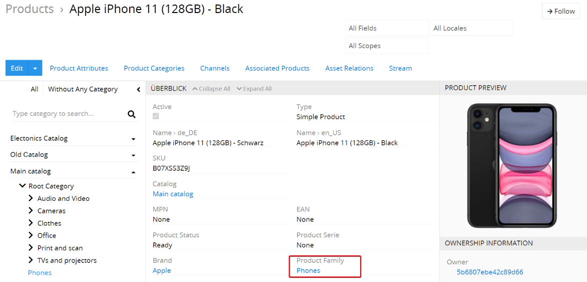
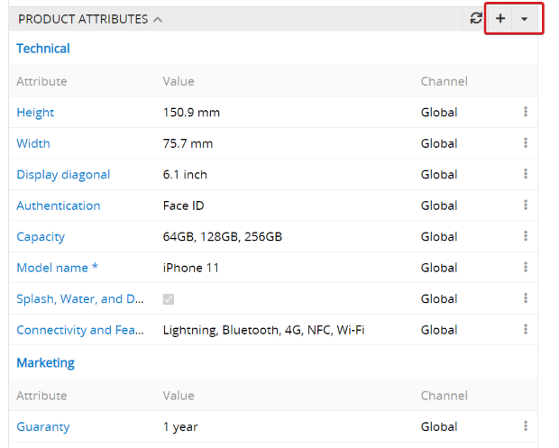
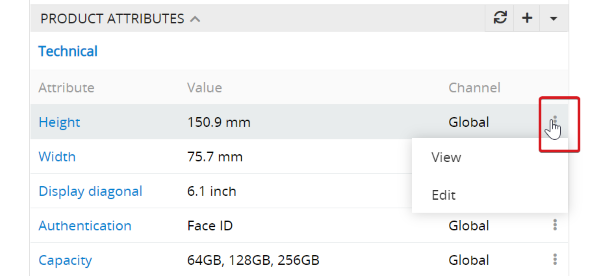
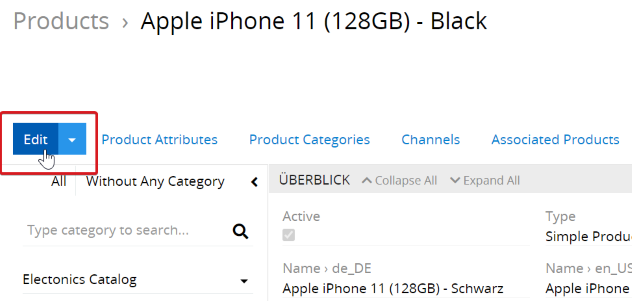
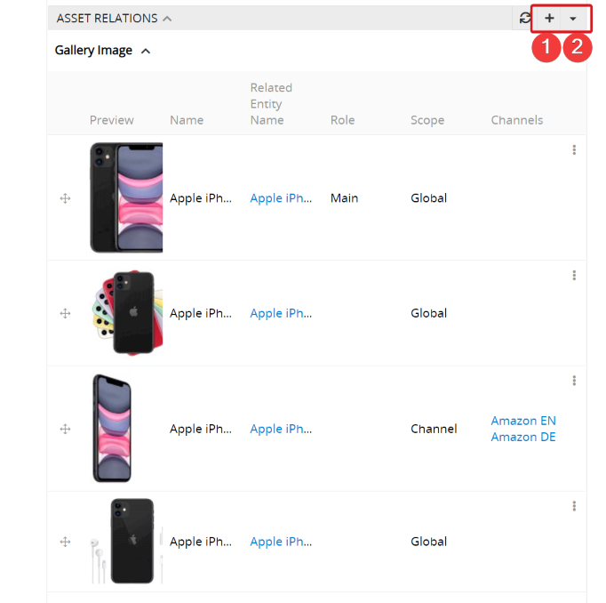
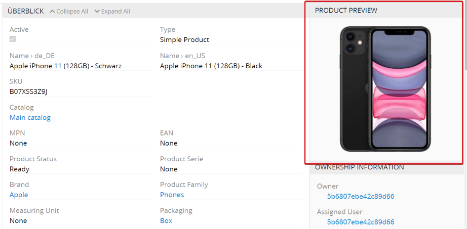
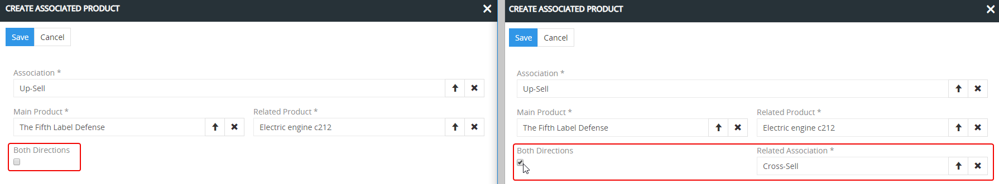
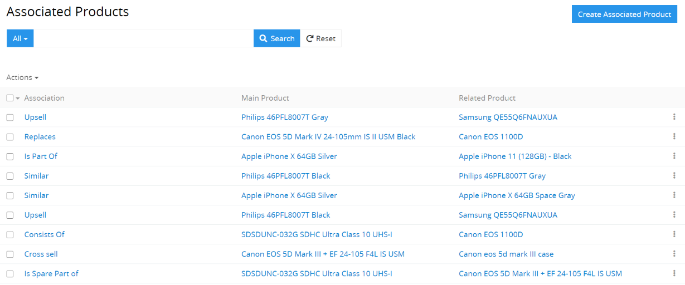
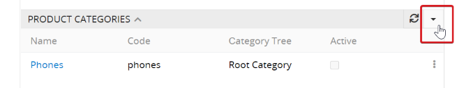

# How to create a complete and qualitative product description in 6 steps? 

Modern CMS (Content Management Systems) make it possible to create a product in a few clicks. However, the website visitor cannot make the decision to purchase your product if the product information you provide does not include answers to customer questions (or the customer cannot find the answers quickly). What are the advantages of this product? How does the product differ from products from other manufacturers? Through the fabric? By the color? For each product group you can determine your own critical questions to which the customer needs answers.

If you want to differentiate yourself from the competition, you need to start with your product information and make it as detailed and qualitative as possible. The end user must have no questions or doubts when making the decision to buy your product.

In order for the product information to be qualitative and complete, you have to:

- Write detailed marketing product descriptions - you have to describe the product in such a way that the customer can imagine it with closed eyes after reading the description to him.
- describe the product as precisely as possible using technical characteristics. You have to consider that the more attributes the product has, the more filter options the end customer has.

- Upload quality product photos from all angles. If necessary, you can also present photos of individual product parts if it helps the customer with the purchase decision.
- Add additional media information, e.g. product videos, instructions, etc.
- Offer product associations to draw the end customer's attention to other products.

In this article we will detail the steps to create a qualitative product description in AtroPIM.

## Step 1: Create a proper product family

For a newly created product, you can specify the product family so that the required product attributes to be filled in can be linked to the product. Before creating the new products, you have to make sure that all the necessary product families have been created and configured correctly.

For more information on creating and configuring product families, read the article ["How to create product families?"](./how-to-create-the-product-families.md).

## Step 2: Create a new product

In AtroPIM you can save the product properties in two ways:

- Via product fields (fields of the Products entity) - can also be used for storing metadata.
- Via product attribute values - additional entity that is linked to the products via a many-to-one relationship.

The user can create any number of product attributes. Product fields can only be created by the administrator via the `Entity Manager`. The main difference is that all products have identical product fields but different product attributes.

To create a product, go to the Product entity and click on `Create Product` (top right). A pop-up window is displayed in which you should fill in the mandatory fields for the new product.

The product fields can contain the information that is important for system users but not for end customers. This can be ID, SKU, alternative names of the products, etc.

## Step 3: Enter the attribute values of the product

The attribute (the property) - is a characteristic of the product. These are, for example, “Style” for shirts, “Diagonal” for screens and “Print performance” for printers. The attributes can be of a functional, emotional or aesthetic nature and describe certain properties of the product, e.g. weight, height, length, width, color, etc.

Product attributes can be linked to the products in two ways - via product families:

or directly.

For example, if you assign a product to the “shirts” product family, these attributes are automatically linked to the product and the users are asked to fill the following attributes: gender, size, color, collar size, etc. (depending on which attributes are assigned to the product family  “shirts”). Therefore the correct configuration of product families is very important for the final quality of the product information. For more information, read the article [“How to create the product families?”](./how-to-create-the-product-families.md).

Product attributes can also be linked directly to the products; these are then mandatory fields for a product. The product has these attributes in addition to those inherited from the product family. If no product family is assigned to a product, it will only have attributes that have been assigned to it directly.

After the product attributes have been linked to the product, the attribute values can be entered. This can be done in two ways, via the context menu of an attribute:

or by editing the product:

For more information about attributes, please read the documentation [“Attribute”](https://github.com/atrocore/atropim-docs/blob/master/en/user-guide/attributes.md).

## Step 4: add pictures and other assets

The potential customers perceive the products primarily visually. Therefore, qualitative product photos are crucial when making a purchase decision. The more such product images are available, the easier it is to examine the product, i.e. to assess its quality and characteristics and evaluate whether it meets customer requirements.

In AtroPIM, an image can be assigned to more than one product. And if you need to replace that image with a new one, all you have to do is do it in one place, and thanks to the links, the image is replaced on all products at the same time.

The product images are displayed in the Asset Relations panel. The assets are automatically grouped according to their types.

Here you can upload new assets (1) or select the assets that already exist in the DAM (2). You can upload files of various formats and sizes: csv, png, md, jpg, zip and other files that are allowed by the configuration. Maximum file size can also be configured. For convenience, the ability to select the asset according to the code that is unique to each asset has been added.

It is also possible to assign different roles to the assets. The possible values can be configured via the Entity Manager. The role Main should be assigned to the main screen. It is displayed in the `Product Preview` panel:

The user has the option of determining the order of the images using drag-and-drop.

### Metadata for images

The user also has the option of editing the metadata for each asset. These can be configured via the `Administration` for the entity Asset Relation via the` Entity Manager`.

### Scope for pictures

You can specify the scope for each asset: `Global` or ` Channel`. If you select `Global`, the asset will be assigned to all channels for which your product is available. If you only want to export the asset to certain channels, you have to select `Channel` as scope and a corresponding channel.

This function can be helpful if you want to give certain trading partners (among all) certain competitive advantages, e.g. access to a larger number of images or to images of a higher quality. Thanks to this function, you can add new images to each channel if necessary. For example, if you have two channels that are used in different regions (e.g. Korea and India), you can add the images with models of the corresponding origins to the products for each country separately.

## Step 5: Enter associated products

The product associations can be an important marketing tool for increasing your sales, as additional products are offered in addition to the main product. The association is a certain type of relationship between the products; each user can define the required relationships for himself, e.g. cross- and up-selling.

You can use existing pre-configured associations or create new associations. The associations can improve the effectiveness and conversion rate. For more information, read [“First steps - how to configure the system correctly?”](./first-steps-how-to-configure-the-system.md#configure-associations).

In AtroPIM you can create unilateral (product A is associated with product B, but not vice versa) as well as bilateral associations (product A and product B are associated with each other). With two-way association, there is also the option of specifying different types of association between the products.

To create a product association, you have to go to the corresponding product page and click on `+` in the` Associated Product` panel. A popup will open where you can create the association with this and a selected product. If you activate the checkbox `Both Directions`, the additional field ` Related Association` is displayed. In this field you can select the type for backward association. An example of a bilateral association: product A is associated with product B, the association type is up-sell; and product B is associated with product A, the association type is down-sell.

All associations between the products can be seen on the `Associated Products` page. When creating a two-way association, two different entries are added to this page.

## Step 6: Categorize the product

In order for your product descriptions to reach the end customers, one or more categories must be specified for each product to which the product is assigned.

In AtroPIM it is possible to use one or more category trees that are automatically created with the help of parent-child relationships. Each child category can only have one parent category, each parent category can have one or more child categories.

By belonging to a category tree, it is automatically determined which channels the product is assigned to. A category tree can be assigned to several channels.

For more information, read the article [“How to categorize the products?”](./how-to-categorize-the-products.md).
